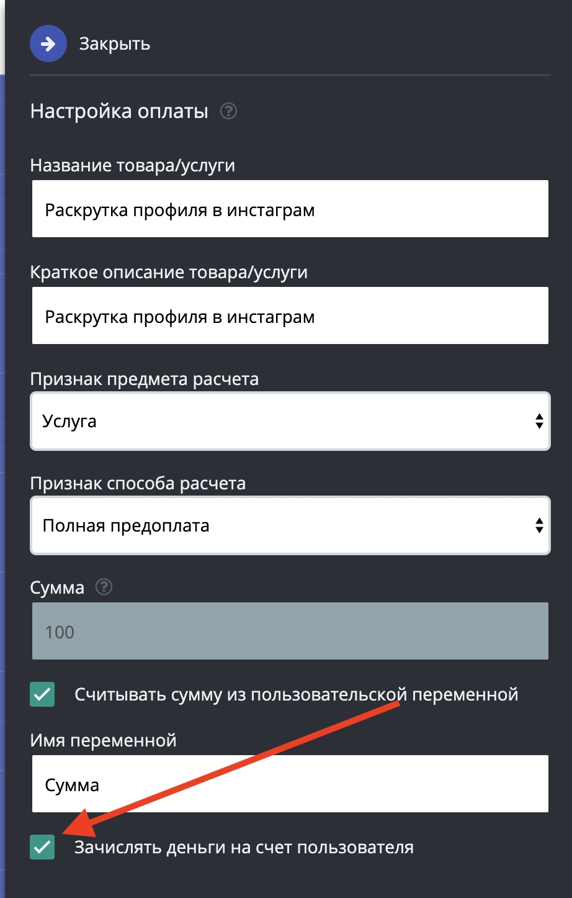
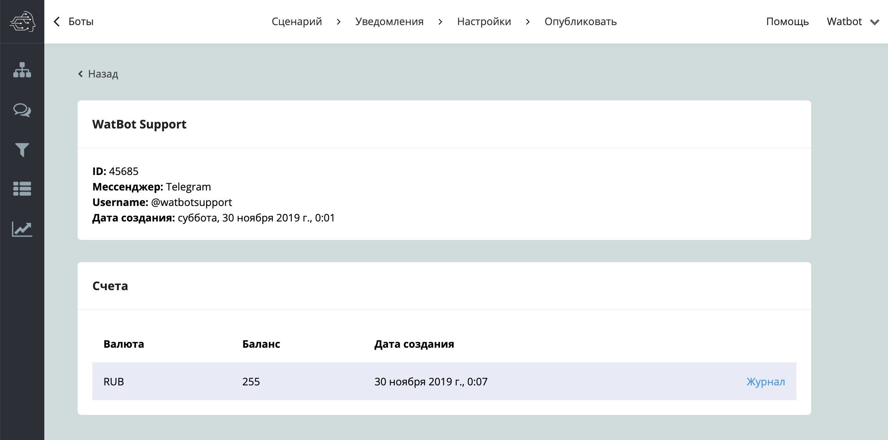
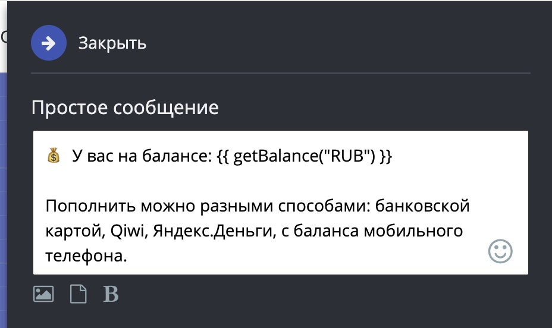

# Баланс подписчика в чат-боте

## Пополнение баланса ваших клиентов для совершения будущих покупок в боте

На сколько вам известно, в нашем сервисе возможно принимать оплату в ботах. Обычно клиенты выбирают какой-то товар или услугу и переходят по ссылке в платежную систему для совершения покупки. Но иногда требуется чтобы клиент пополнил свой баланс, а затем расходовал его на какие-то покупки в боте. Исходя из данной потребности мы начали внедрять эту функцию.

#### 1. Пополнение баланса

Создайте блок оплата любой платежной системы, например, ЮКасса, откройте его настройки и поставьте галочку **«Зачислять деньги на счет пользователя».**

Теперь средства будут зачислятся на счет пользователя. Впервую очередь для него будет создан счет в той валюте, которую вы настроили для платежной системы. Список счетов можно посмотреть в разделе: **Ваш бот** > **Списки** > **Контакты** > **Необходимый Контакт**

По каждому счету ведется журнал оперций**:**

#### 2. Списание средств (покупка)

На данный момент списывать средства возможно только через API. Подробнее на [https://docs.watbot.ru/rabota-s-api/kontakty/scheta](https://vk.com/away.php?to=https%3A%2F%2Fdocs.watbot.ru%2Frabota-s-api%2Fkontakty%2Fscheta\&cc\_key=)

**Текущие возможности API:**

1. Получение списка счетов.
2. Создание счета по коду валюты ISO 4217
3. Удаление счета
4. Пополнение счета
5. Списание средств со счета

#### 3. Отображение баланса в боте

Для отображение баланса клиента добавьте в сообщение бота вызов функции: `{{ getBalance("USD") }}`, где USD - код валюты.

\
