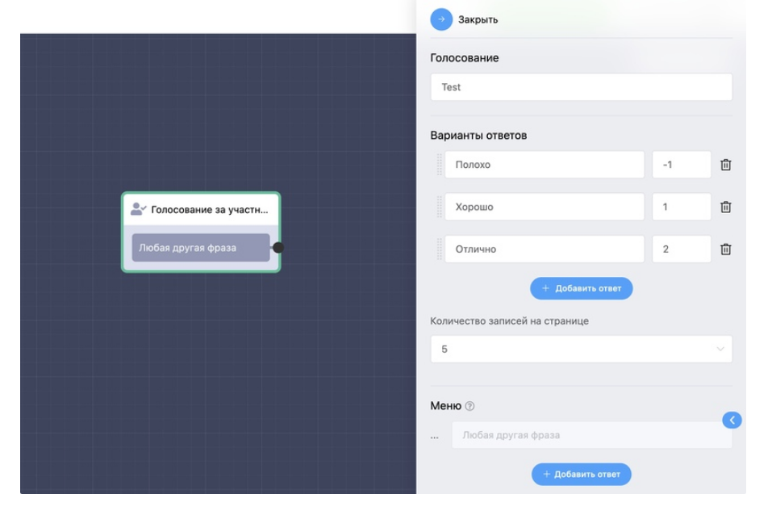
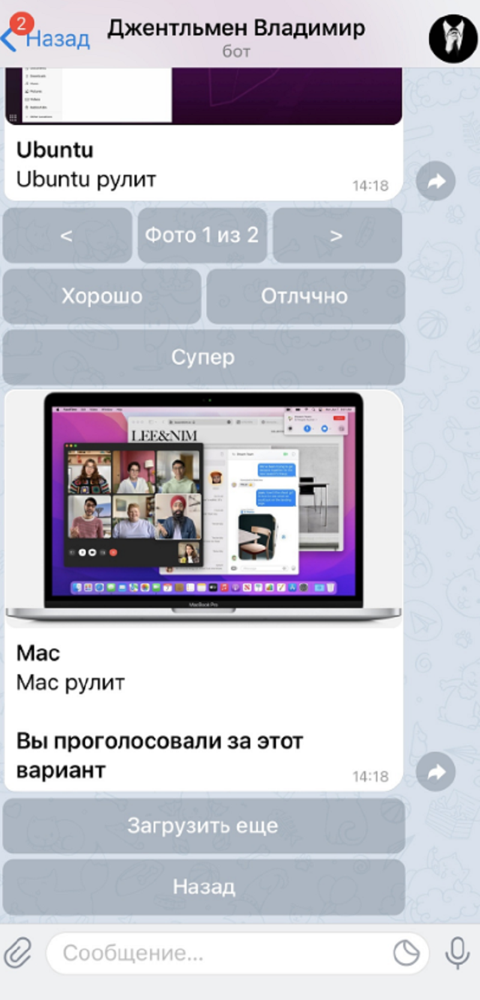

# Голосование за участника

С помощью этого блока пользователи могут голосовать за участников голосования. В настройках блока можно добавить кнопки для голосования и их вес (балл). Балл может быть отрицательным, тогда количество результирующих балов у участника голосования будет уменьшаться, а не прибавляться. Также возможно настроить количество участников, которые бот будет присылать за один раз.

> На данный момент проголосовать можно только через бота Telegram!


