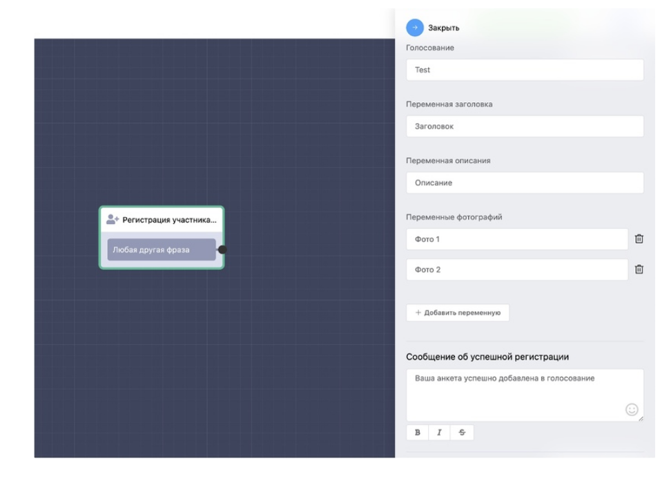

# Регистрация участника голосования

Вы можете дать пользователям бота самостоятельно регистрировать свою кандидатуру в качестве участника голосования. Для этого создайте простую анкету в сценарии бота и сохраните каждый ответ пользователя в переменную, а затем просто сопоставьте эти переменные с данными для голосования.

