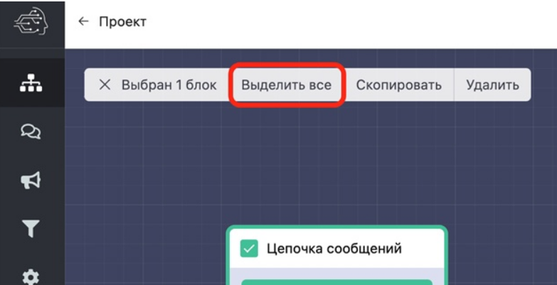

# Интерфейс добавления блоков

Все блоки разбиты на категории:

* все
* простые
* уведомления
* списки и таблицы
* платежи
* магазины
* рассылка
* голосования
* интеграции
* специальные&#x20;
* enterprise

Также вы можете искать нужный блок по одному из слов в его названии. Вводите слово из названия в строку поиска и появляется список блоков с введённым словом.

При нажатии на квардат слева в блоке появляется окно, где вы можете выделить все блоки сценария, скопировать или удалить выбранные блоки.\
\
Такая функция удобна для копирования сценария вручную.



