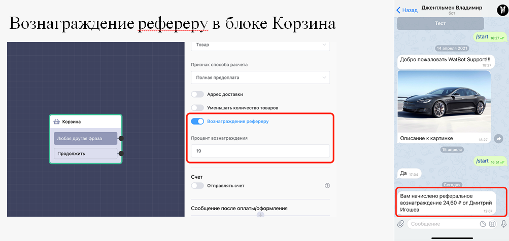

# Корзина

### Постоплата в корзине

В некоторых бизнес моделях необходимо принимать оплату от клиента только после доставки товара, в этом случае поможет опция постоплата в настройках блока «Корзина».

Платежные системы для постоплаты поддерживаемые на данный момент:

.png>)

### Адрес доставки в корзине

При оформлении заказа клиент может ввести адрес доставки. Для этого включите необходимую опцию в блоке «Корзина». При оформлении заказа вы получите соответствующее уведомление содержащее адрес доставки.

**Пример запроса адреса доставки при первом заказе:**

**Пример запроса адреса доставки при повторном заказе:**

​.png>)

### Генерация счета в корзине

Иногда нужно отправить счет клиенту после оформления заказа. Просто включите необходимую опцию в блоке «Корзина», и наша система отправит счет в виде PDF-документа.

**Пример счета**

Логотип и ставка НДС настраивается в том же блоке «Корзина».

### Вознаграждение рефереру

Если в вашем магазине есть реферальная система, то вы можете прямо в блоке корзина настроить процент, который будет начисляться рефереру после совершения покупки его рефералом.

