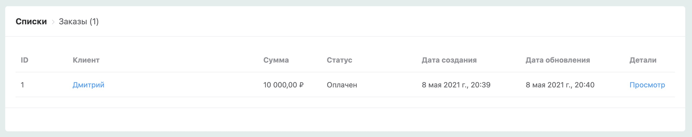
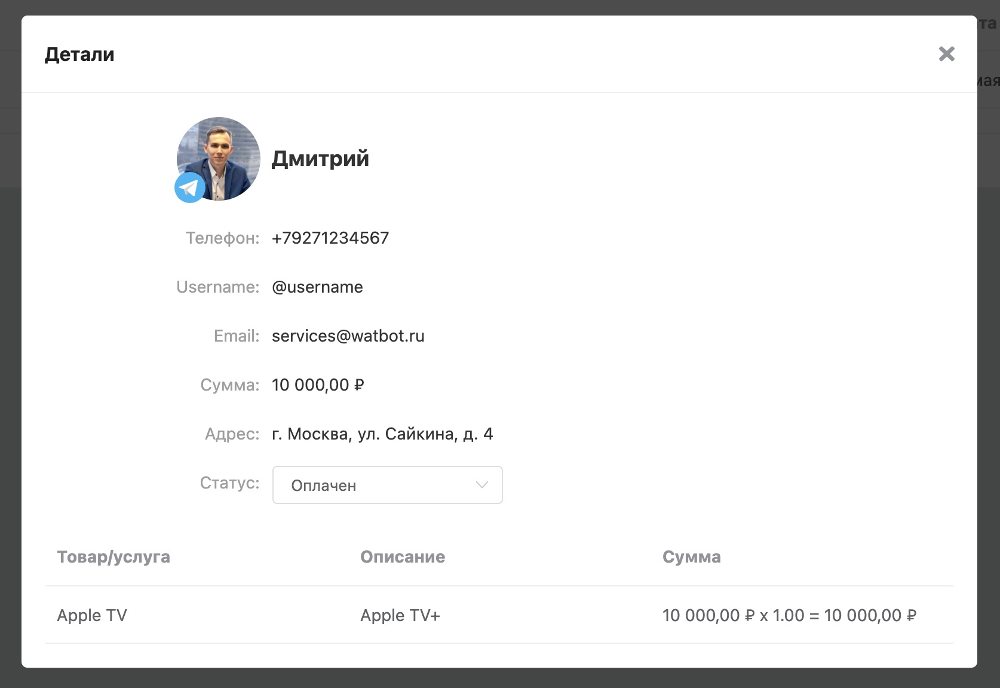
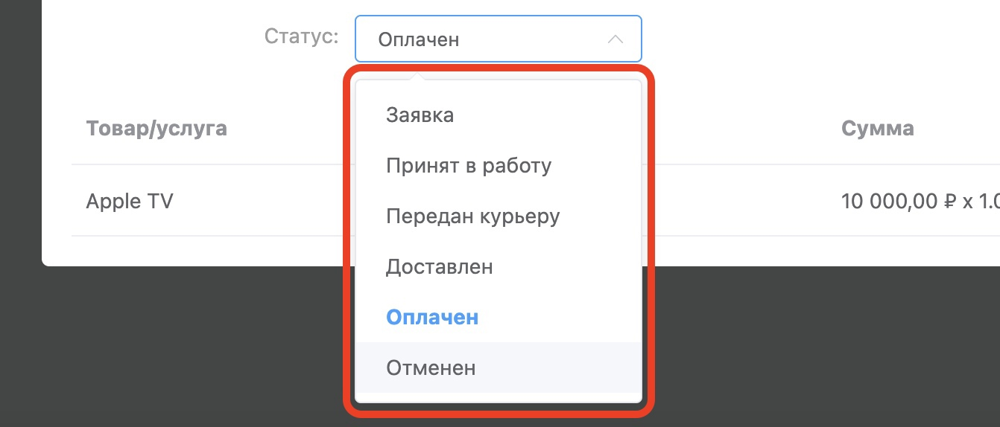
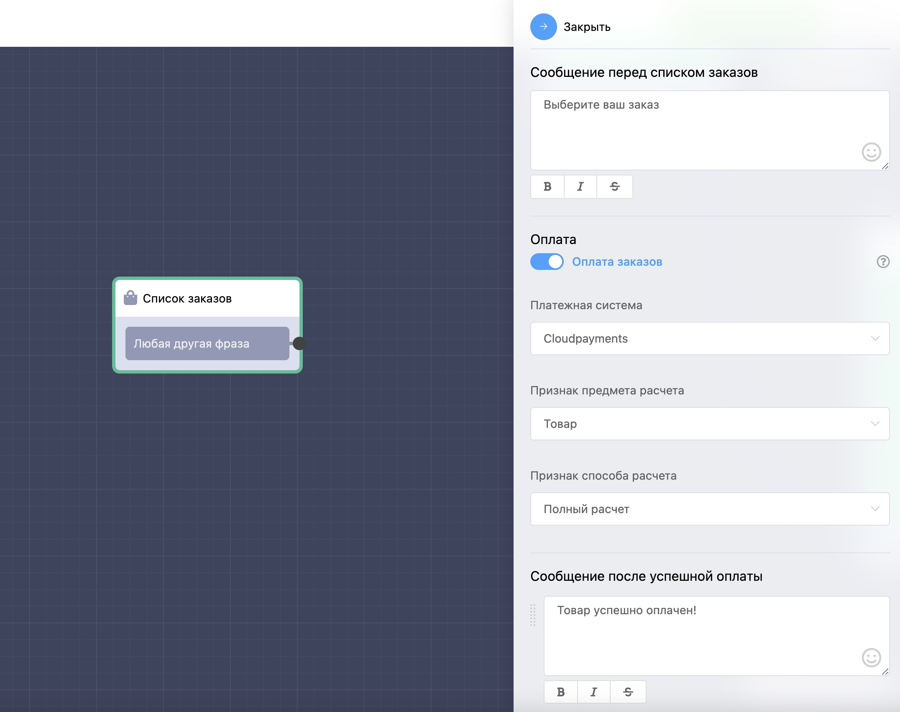
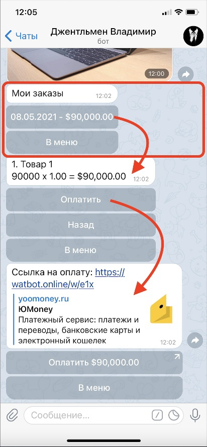

# Список заказов

После создания заказа, заявка отобразится в разделе **Ваш бот** → **Списки** →**Заказы.**

Вы можете открыть детали заказа для просмотра подробной информации, а также вручную изменить статус заказа. После оплаты статус заказа автоматически меняется на «Оплачен».

Поддерживаемые статусы заказа:

Для того чтобы клиент смог просматривать и оплачивать свои заказы, мы разработали специальный блок «Список заказов».

#### Как это выглядит в боте?

Список заказов отображается в виде кнопок, нажав на которую, можно провалиться в карточку заказа со списком товаров и оплатить товар, если он не оплачен.

