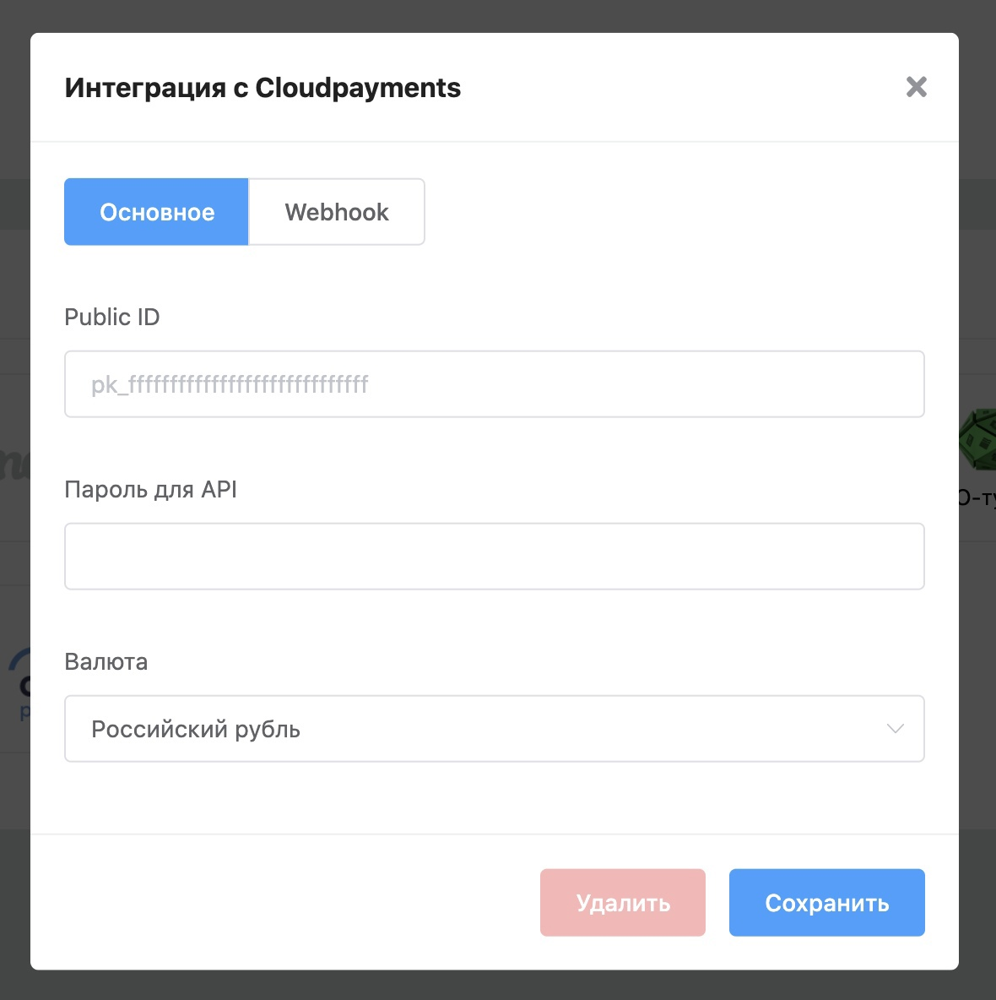
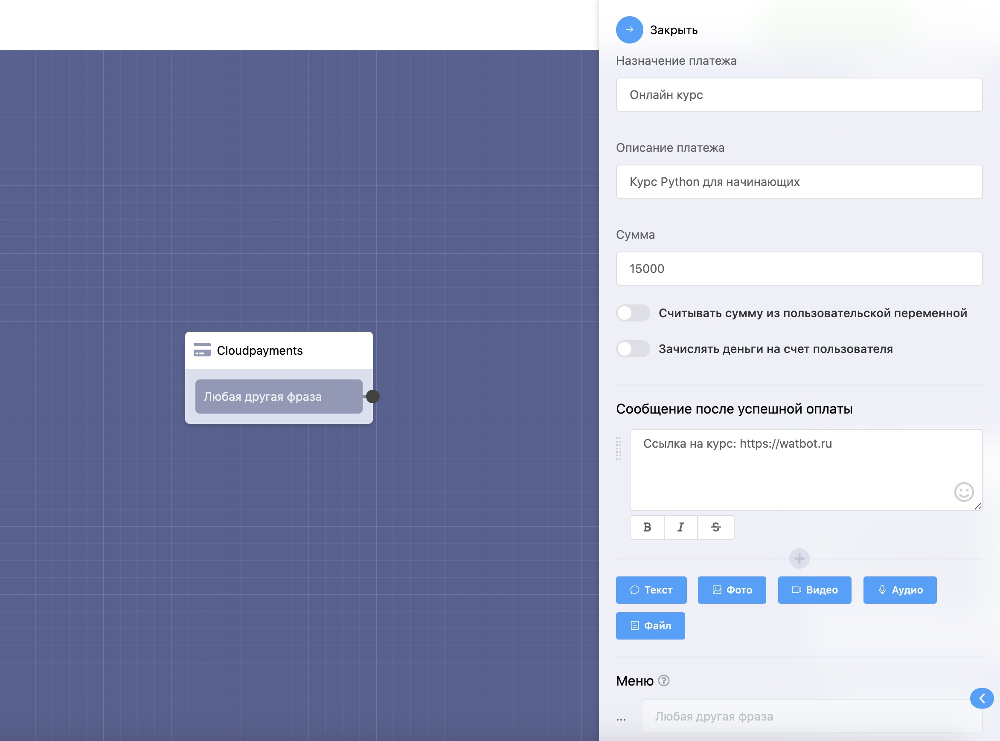

# Cloudpayments

Разработали интеграцию с сервисом для приема платежей [Cloudpayments](https://vk.com/away.php?to=https%3A%2F%2Fcloudpayments.ru%2F\&cc\_key=). Теперь вы сможете принимать оплату в ботах с помощью данного сервиса.&#x20;

Чтобы настроить интеграцию, перейдите в **Вашего бота** → **Настройки** → **Интеграции** → **Cloudpayments**.

**Public ID** и **пароль для API** находится в вашем личном кабинете Cloudpayments.

После настройки интеграции в сценарии бота создайте блок **«Cloudpayments»** и настройте его необходимым образом, например после совершения платежа можно отправить ссылку на онлайн курс.

