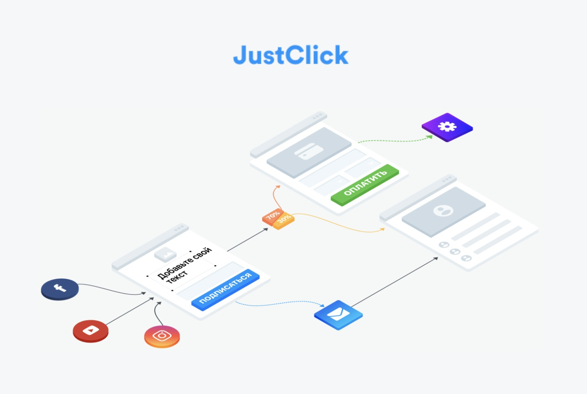
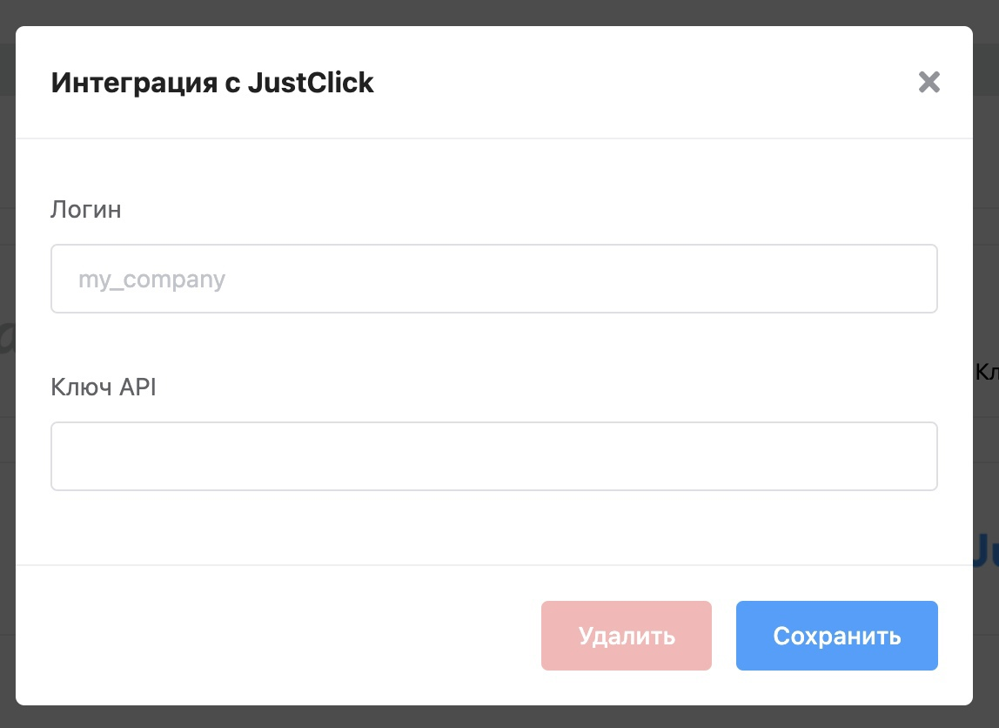
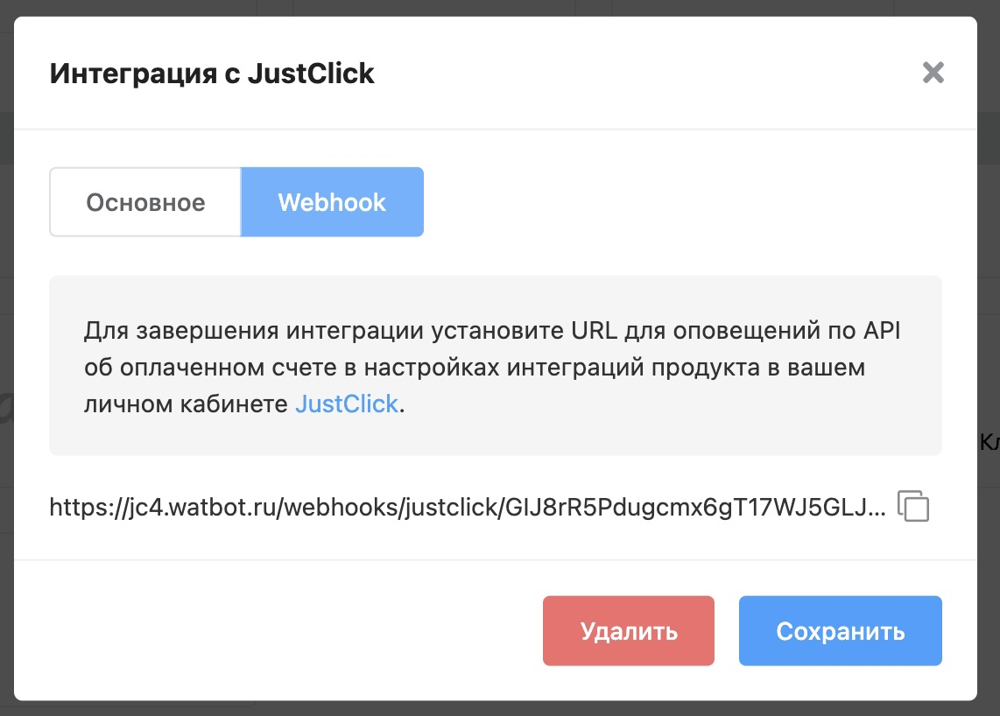
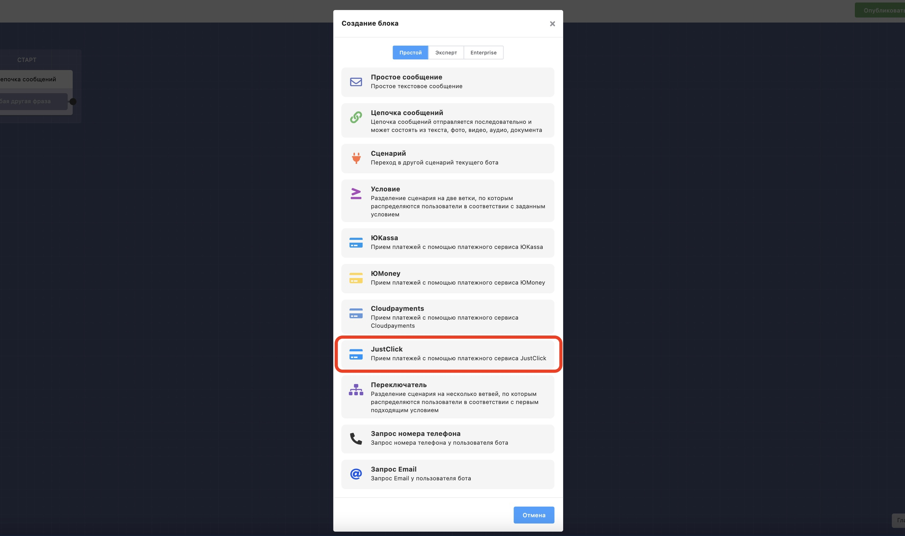

# JustClick

Разработали интеграцию с сервисом [JustClick](https://vk.com/away.php?to=https%3A%2F%2Fjustclick.ru%2F\&cc\_key=), который позволяет принимать платежи в ботах без онлайн-кассы.

### Шаг №1 — Настройка интеграции

Откройте сценарий вашего бота, далее **Настройки** → **Интеграции** → **JustClick.**

Для интеграции понадобится ваш логин и Ключ API [JustClick](https://vk.com/away.php?to=https%3A%2F%2Fjustclick.ru%2F\&cc\_key=), для этого откройте ваш личный кабинет JustClick. Логин находится в разделе **Профиль** → **Изменить пароль** — [https://justclick.ru/profile/edit/](https://vk.com/away.php?to=https%3A%2F%2Fjustclick.ru%2Fprofile%2Fedit%2F\&cc\_key=), ключ API находится в разделе **Интеграции —** [https://justclick.ru/shops/setts/apisettings/](https://vk.com/away.php?to=https%3A%2F%2Fjustclick.ru%2Fshops%2Fsetts%2Fapisettings%2F\&cc\_key=)

После сохранения настроек откройте вкладку Webhook и для завершения интеграции установите URL для оповещений по API об оплаченном счете в настройках интеграций продукта в вашем личном кабинете [JustClick](https://vk.com/away.php?to=https%3A%2F%2Fjustclick.ru%2F\&cc\_key=).

### Шаг №2 — Блок оплаты

Добавьте в ваш сценарий блок JustClick.

Откройте настройки блока, введите ID продукта, назначение платежа, описание платежа. Если вы не знаете где взять ID продукта, наведите курсор мыши на вопросик рядом с полем. Назначение платежа и описание сохраняются в список платежей на платформе, так же описание платежа отправляется в заказ JustClick. Остальные настройки аналогичны другим блокам оплаты.

