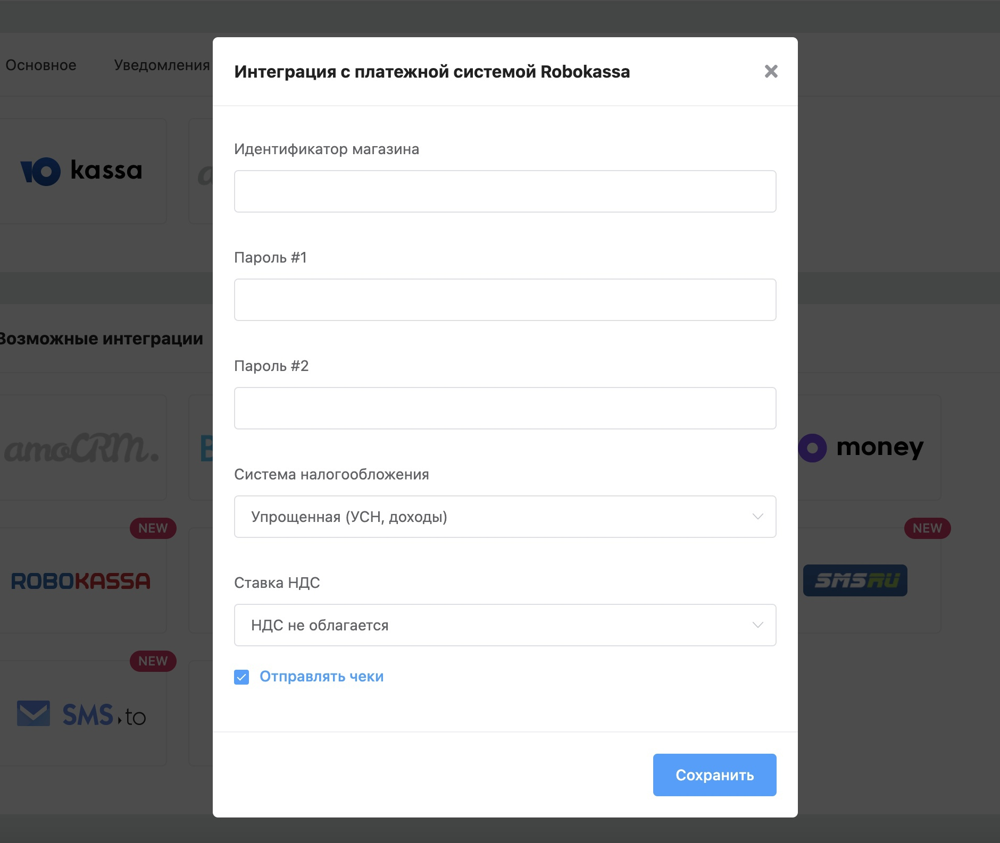
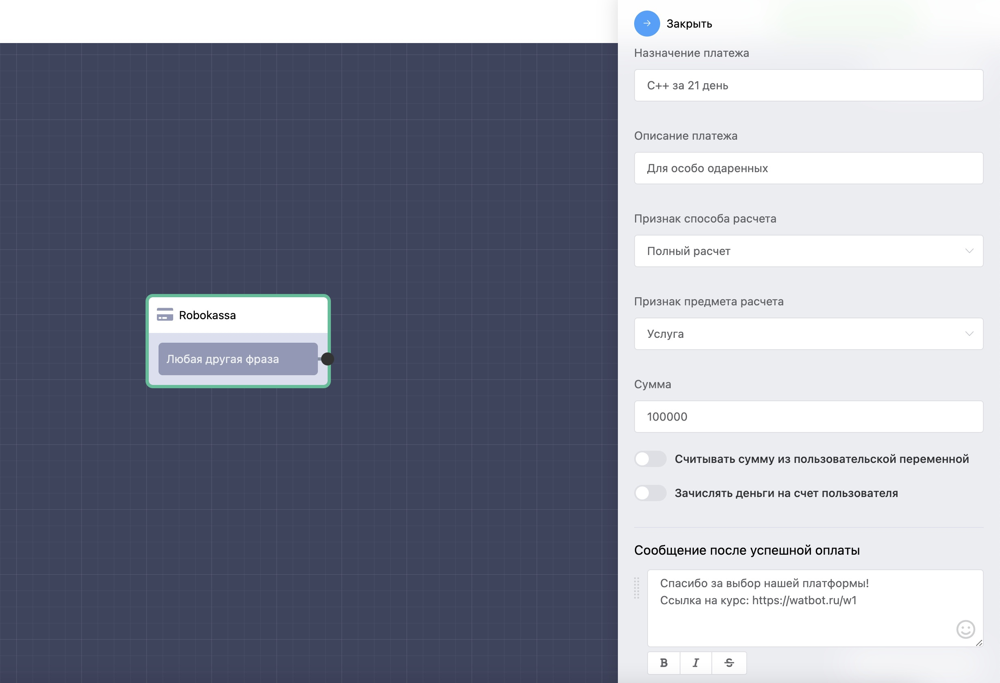

# Robokassa

Преимущество данной системы в том, что не нужно подключать свою онлайн кассу, Robokassa может сама отправлять чеки от своего имени для вашего магазина.

Для настройки платежей разработали специальный блок **«Robokassa»**.

Вы можете выбрать страну для данной интеграции:

<figure><figcaption></figcaption></figure>
