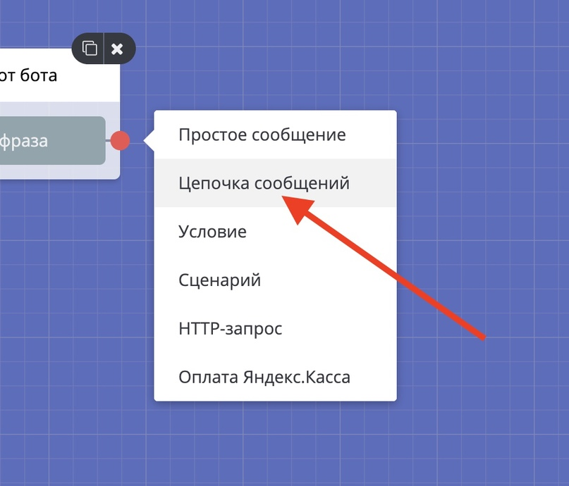
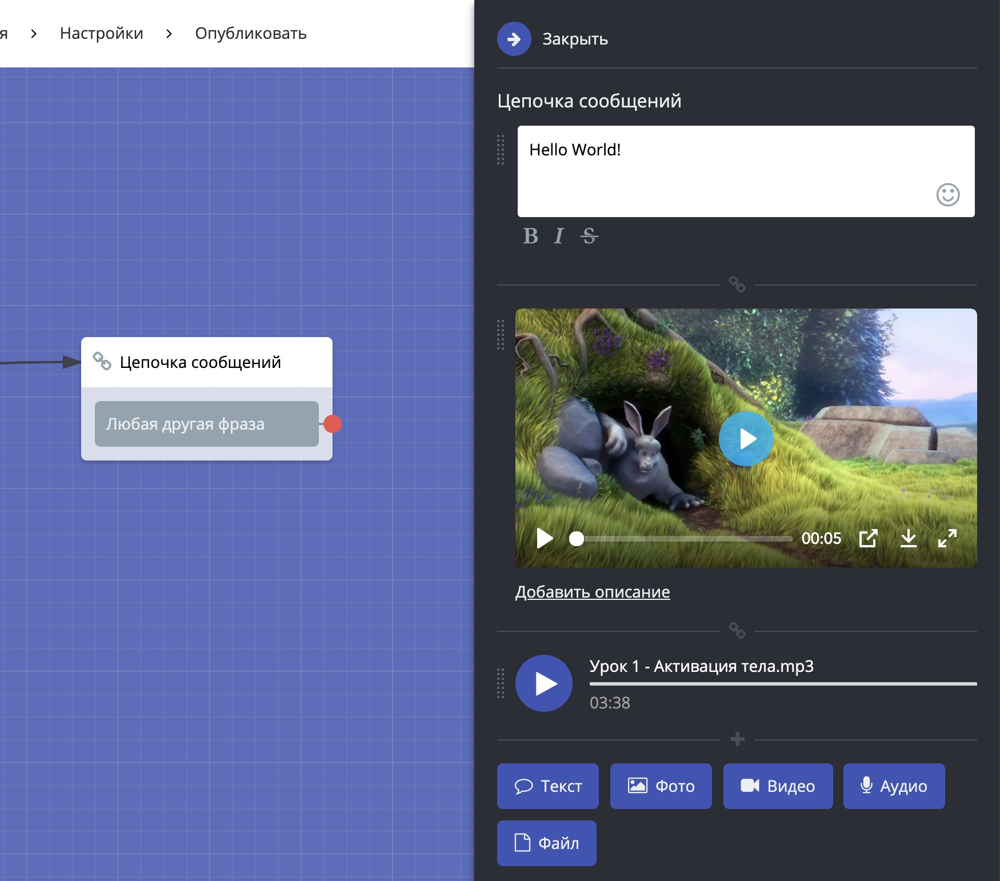

# Цепочка сообщений

Цепочка из сообщений, которые последовательно приходят клиенту.&#x20;

К простому сообщению нельзя прикрепить медиа-файлы, вместо этого используйте цепочку сообщений.

При добавлении нового блока просто выберите соответствующий пункт меню.


Обратите внимание на то, что без текста или файла блок не будет работать, даже при наличии кнопок в нем, а значит бот не будет двигаться по цепочке(если цепочка сообщений без текста в середине сценария) и запускаться (если такой блок в начале)


Цепочка сообщений настраивается как обычный блок.

Сообщения могут быть разных типов:&#x20;

* текст
* фото
* видео (бывают случаи, когда Телеграм может растягивать видео. Попробуйте поменять формат или размер),
* аудио
* документ

Одна цепочка вмещает в себя до 10 сообщений.

Сообщения можно сортировать, просто перенесите мышкой нужно сообщение в нужное место вашей цепочки.

Для медиа-файлов внедрили встроенный плеер.

Так же при загрузке медиа теперь показывается прогресс загрузки, актуально для больших файлов.

С помощью этого блока возможно выводить следующие константы:

* полное имя,
* имя,
* фамилия,
* телефон,
* email,
* адрес,
* username.

В данном блоке доступен следующий дополнительный функционал:

* отключение предпросмотра ссылок в Телеграм

<figure><figcaption></figcaption></figure>

* доставка сообщений без звука в Телеграм

<figure><figcaption></figcaption></figure>

* защищенный контент в Телеграм (запрет на пересылку сообщений)

<figure><figcaption></figcaption></figure>

* подмена сообщения в Телеграм при нажатии на инлайн-кнопку (т.е. при нажатии на инлайн-кнопку вместо отправки сообщения оно заменит то, где была нажата кнопка).&#x20;

Обратите внимание, что подмена сообщений работает         только если предыдущее сообщение было текстовое. Т.е. если у вас в сценарий было "цепочка сообщений" + условие + "цепочка сообщений" с подменой предыдущего, это не сработает т.к. предыдущее сообщение было не текстовое.

Также следует учитывать что подмена сообщений работает только для однотипных сообщений, т.е. картинка может подменять только картинку.

<figure><figcaption></figcaption></figure>

В кнопках доступна обработка простых функций:

Список простых функций:

•sum()

•diff()

•div()

•multiplication

•сумма()

•разность()

•деление()

•произведение()

•rand()

•strRandom()

•time()

•date()

•substr()

\*Список может пополняться

<figure><figcaption></figcaption></figure>


