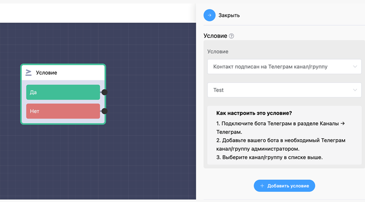

# Тип условия "Контакт подписан на Телеграм канал/группу"

С помощью этого условия вы можете проверять подписан ли пользователь на нужный вам канал или группу и в зависимости от этого разделить по разным веткам подписавшихся и нет.


