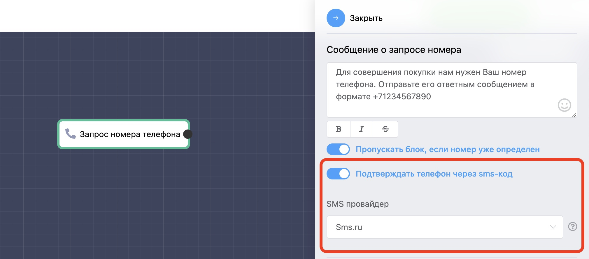

# Настройка верификации телефонов в блоке «Запрос номера телефона»

Для включения верификации номеров телефонов просто активируйте опцию «Подтверждать телефон через sms-код» и выберите SMS-провайдер, которого вы интегрировали через раздел **Ваш бот → Настройки → Интеграции.**

