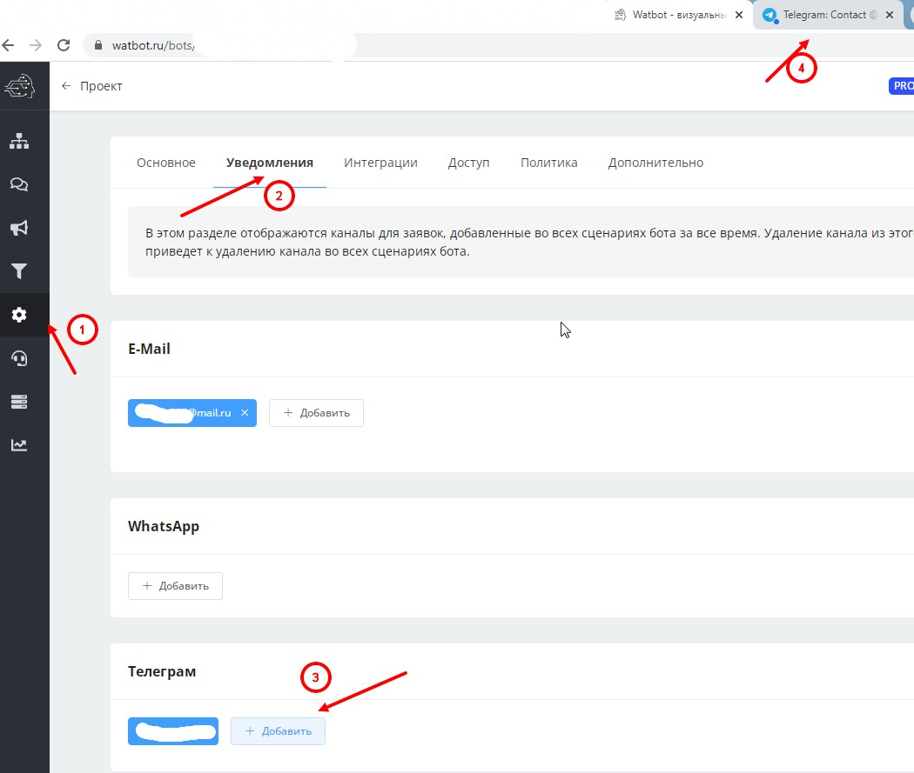

# Заявка

.jpg>)

Это обновление даёт более гибкие настройки для маршрутизации заявок:

* гибкая настройка каналов для заявки ( Telegram, Whatsapp, crm, email)&#x20;
* упрощённое подключение каналов для WhatsApp и Telegram (больше не требуется вводить код из специального бота для подключения каналов. Нажимаем на кнопку “добавить аккаунт”, нас перебрасывает в бот с реферальной ссылкой, нажимаем “начать”. После этого получаем уведомление что получение заявок для установленного канала подключено)&#x20;
* копируется при клонировании блока или сценария&#x20;
* возможно создание заявки сразу после блока “старт”

Ограничения по максимальному количеству каналов: email - 50 Telegram - 50 WhatsApp - 5

Данный блок нельзя ставить за блоками “заявка” и использовать в рассылке.

Чтобы добавить менеджера зайдите слева в раздел настройки, уведомления. Выберите нужный канал уведомлений, нажмите "добавить", скопируйте ссылку из нового открывшегося окна и отправьте её менеджеру.

После того, как этот менеджер перейдёт по ссылке, вы можете таким же образом создать ссылку для другого менеджера. Обратите внимание, что срок действия ссылок ограничен.

<figure><figcaption></figcaption></figure>




