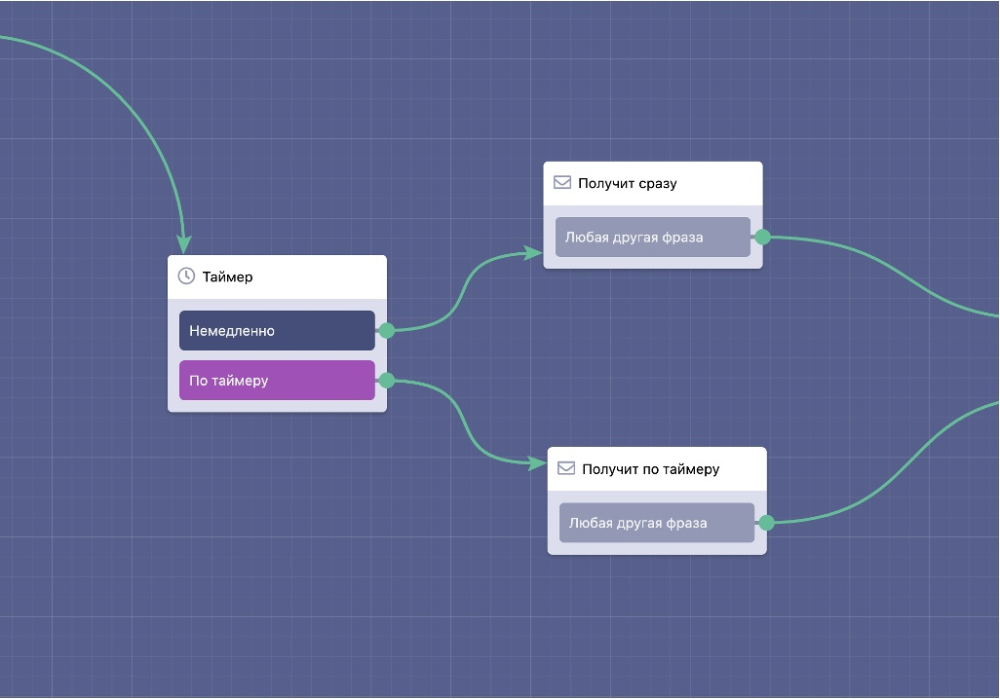

# Таймер

Блок таймер для отложенной отправки сообщений. Это позволяет создавать авторассылки прямо в сценарии бота.

Обратите внимание, что следующие блоки нельзя ставить после блока "таймер":

* Все блоки из раздела "Платежи"
* Отправить сообщение&#x20;
* Отправить быстрое сообщение&#x20;
* HTTP-запрос&#x20;
* Чтение записи/ей из списка&#x20;
* Добавление записи в список&#x20;
* Проверка существования записи в списке&#x20;
* Бронирование записи из списка&#x20;
* Чтение строк из таблицы&#x20;
* Корзина&#x20;
* Чтение записи/ей из клиентской базы&#x20;
* Встроенный бот Телеграм&#x20;
* Заказы&#x20;
* Запись в Google Таблицу&#x20;
* Регистрация участника голосования&#x20;
* Голосование за участника&#x20;
* Лидеры голосования&#x20;
* Заявка&#x20;
* Уведомление&#x20;
* Уведомление для контакта

Также для данного блока доступна автоподстановка, по аналогии с блоком "задержка":

<figure><figcaption></figcaption></figure>


