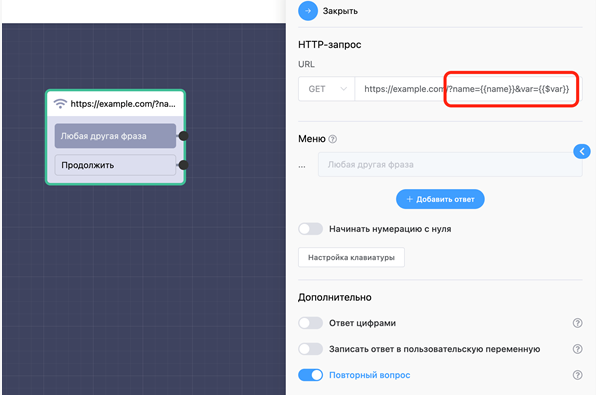

# Исходящий Webhook

В данном блоке можно настроить данные для отправки (id контакта, имя, фото…). Он позволяет только отправлять данные, не принимать. При необходимости принимать данные можно воспользоваться функционалом открытого api.

В настройках бота есть 2 метода: post (данные приходят в формате json) и get.

[https://webhook.site](https://webhook.site) - сервис проверки данных, которые в действительности приходят через вебхук

В ссылку для блоков HTTP-запрос и Webhook возможно подставлять пользовательские переменные и константы

**Настройка асинхронности для блока «Исходящий Webhook»**

По умолчанию бегунок «асинхронный запрос» находится в активном положении. При попадании в этот блок клиент сразу переходит в следующий, а запрос выполняется в фоновом режиме. Т.е. он может выполниться позже, чем пользователь попадёт в следующий блок. При отключении асинхронности запроса сначала будет выполняться сам запрос, а потом переход в другой блок.

.png>)
