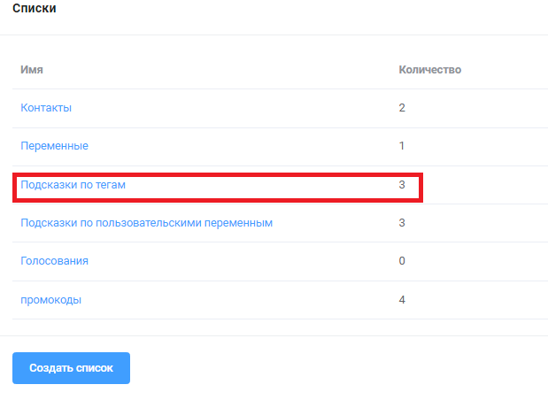
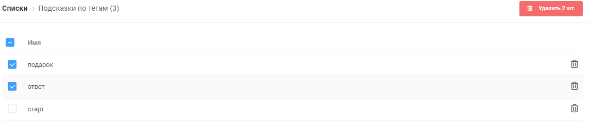

# Назначить тег и Удалить тег

## Блок "назначить тэг

Это обновление даёт возможности назначать тэги на любую кнопку.

> Блок создан на замену предыдущей версии установки тэгов в самом блоке. Старый метод будет действовать до 01.03.2022. До указанной даты в ранее созданных ботах необходимо заменить предыдущий метод на новый.

## Блок "удалить тэг"

С помощью этого блока + блока “старт” можно создавать платные подписки на бота:

* придумываете тарифный план, например “старт” на 7 дней&#x20;
* в блоке оплаты назначить тэг “подписка старт” после оплаты. Т.е. после оплаты подписчик получит тэг “подписка старт”&#x20;
* создать сценарий с сообщением об окончании подписки и удалением тэга “ подписка”&#x20;
* настроить рассылку на созданный выше сценарий с фильтром по тэгу “подписка старт” с отсрочкой отправки 7 дней. Т.е. человек с этим тэгом попадает в рассылку и через 7 дней получает уведомление о том, что его подписка закончена&#x20;
* с помощью блока “удалить тэг” удаляется тэг “подписка старт”

В разделе «списки» находятся подсказки по тегам. Можно удалять подсказки массово или выборочно. Следует учитывать, что удаление тегов из этого списка не удаляет их у контакта










