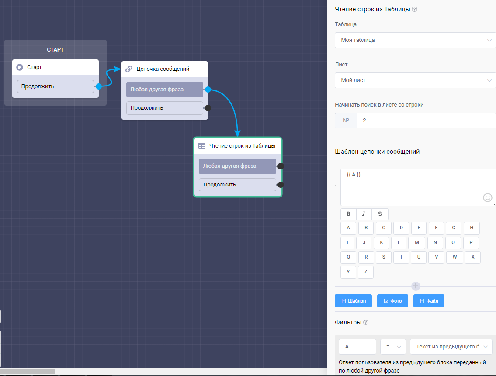

# Чтение строк из таблицы

Данный блок позволяет выводить данный из таблицы в бота. Для этого необходимо:

* создать таблицу на платформе (её можно интегрировать с google таблицей),
* указать эту таблицу в блоке,
* выбрать лист, из которого будет происходить вывод данных,
* указать строку, с которой будет начинаться поиск,
* создать шаблон цепочки сообщений (данные каких столбцов и в каком порядке будут выводится),
* при необходимости добавить фильтр для поиска (название столбца и с чем он сравнивается)


