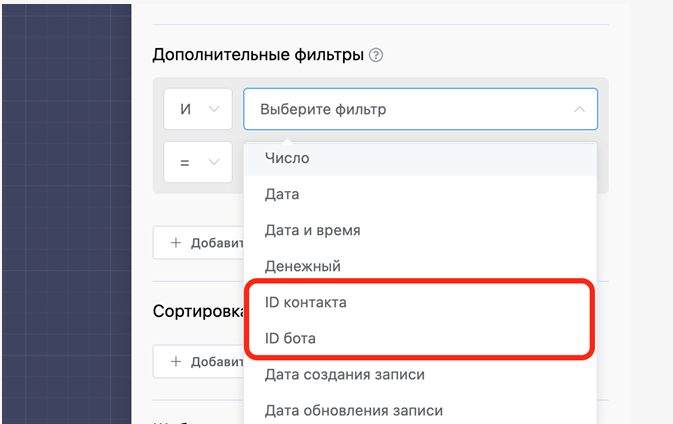
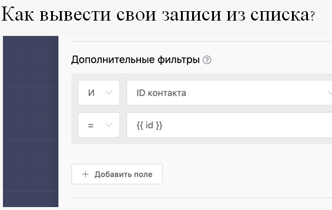

# Чтение записей из списка

Данный блок позволяет боту отправлять клиенту записи из списка. Для этого в разделе **Сценарий** нажмите **Создать блок** и во вкладке **Эксперт** выберите соответствующий блок.

.png>)

Вы можете указать поле для поиска, по которому будет производится поиск по любой другой фразе из предыдущего блока.

.png>)

Каждая запись отправляется отдельным сообщением последовательно, кроме того, картинка или файл приходят так же отдельным сообщением. Текстовое сообщение настраивается в виде шаблона, в котором поля списка прописываются в виде переменных, просто нажмите на кнопку ниже с именем нужного поля и оно вставится в текст.

.png>)

Когда записей много, вы можете включить постраничную навигацию и настроить количество записей для отправки клиенту. Так же вы можете задать произвольный шаблон для выбора страницы, где {n} обозначает номер страницы. Например клиент отправляет боту команду «Страница 2» и бот в ответ присылает еще 10 записей со второй страницы списка.

.png>)

Для настройки сортировки списка вы можете добавить необходимые поля:

.png>)

Для установки дополнительных условий выборки данных из списка добавили раздел **Дополнительные фильтры.**

.png>)

Фильтр «!=» - не равно

**Фильтры «ID контакта» и «ID бота» для блоков «Чтение записи/ей из списка»**

Вы можете фильтровать данные по своему ID. Например, если в списке хранятся записи, связанные с вашим контактом, ты вы можете сделать выборку этих записей. Для этого необходимо в дополнительных фильтрах написать константу «id» и вы получите выборку всех записей, где они имеют ваш ID контакт.





