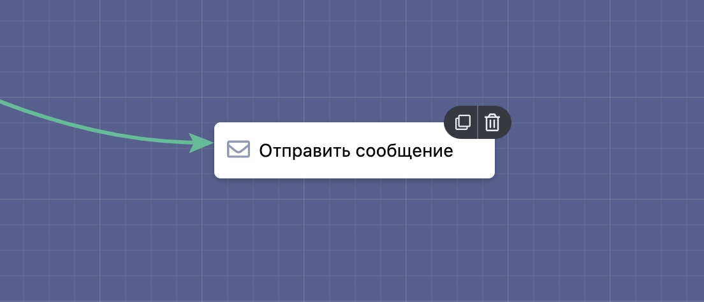
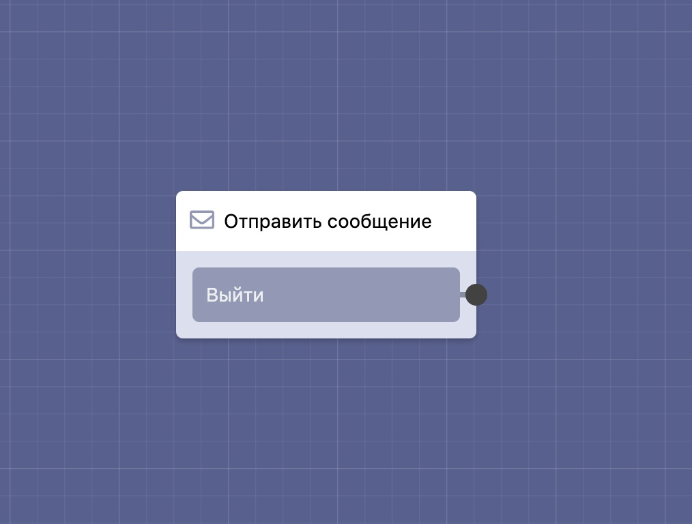

# Отправить сообщение

Разработали новый блок — **«Отправить сообщение»**, который позволяет переписываться пользователям бота между собой, причем не обязательно, чтобы пользователи были из одного мессенджера. Например пользователь WhatsApp может написать пользователю Telegram и т.д.

### Кнопка «Выйти» в блоке «Отправить сообщение»

Теперь в блоке **«Отправить сообщение»** необходимо указывать связь с кнопкой **«Выйти»**, чтобы пользователь мог выйти из диалога с пользователем в любой блок, который вы укажете (ранее при выходе он всегда попадал в стартовый блок).

