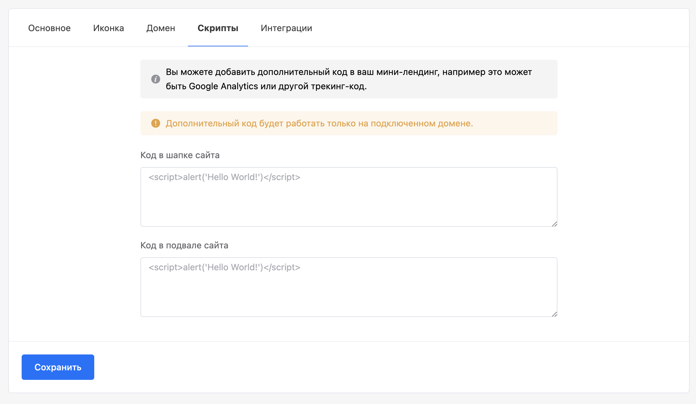

# amoCRM

### 1. Установка приложения в amoCRM

Откройте личный кабинет [amoCRM](https://www.amocrm.ru/), затем перейдите в раздел **amoМаркет** > **Маркетплейс > Чаты и мессенджеры** и установите приложение [Watbot](https://watbot.ru).

<figure><figcaption>
Приложение Watbot
</figcaption></figure>

### 2. Настройка интеграции

Откройте личный кабинет [Watbot](https://watbot.ru), затем перейдите в раздел **Ваш проект** > **Ваш чат-бот** > **Настройки** > **Интеграции** > **amoCRM**. Далее для интеграции достаточно кликнуть по кнопке **«Привязать новый аккаунт amoCRM»** и во всплывающем окне разрешить доступ приложению Watbot к вашему аккаунту amoCRM.

### 3. Воронка, этап, ответственный

Перейдите на вкладку **Дополнительно** на которой вы сможете выбрать ответственного для новых сделок, а также указать воронку и этап, куда будут попадать новые сделки.

При создании сделок вы можете настроить создание задач. Задачи назначаются на ответственного за сделку.

Так же вы можете настроить создание сделок при каждой заявке клиента в Watbot.

<figure><figcaption></figcaption></figure>

### 4. Отключение бота

Если вы хотите использовать виджет amoCRM только для переписки с клиентами, отключите бота  в настройках, в разделе Дополнительно.

<figure><figcaption></figcaption></figure>

### 5. Особенности работы

* В amoCRM возможно написать клиенту первым по номеру телефона, но для этого на платформе Watbot должен быть подключен мессенджер WhatsApp.
* &#x20;Есть возможность работать сразу нескольким пользователям Amo.
