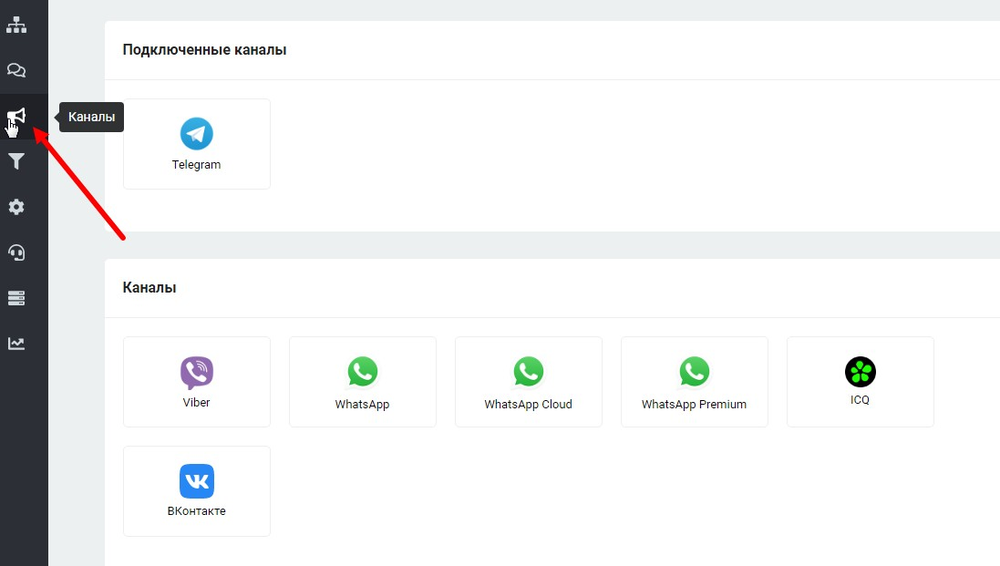

# Каналы (мессенджеры)

Данный раздел находится в левой панели. В нём возможно подключать необходимые мессенджеры:

<figure><figcaption></figcaption></figure>


[whatsapp](whatsapp/)



[viber.md](viber.md)



[telegram](telegram/)



[vk](vk/)



[Broken link](broken-reference)


## Важная информация:

Если на пробной версии настроить бота, но не оплатить до окончания списывания бонусных баллов, то настроенный бот не исчезнет. Он перестанет работать. Но после оплаты вновь заработает на подключенных каналах, сохранив все имеющиеся настройки.&#x20;

Также удаление канала не влияет на сохранность самого сценария и внесённые настройки.


