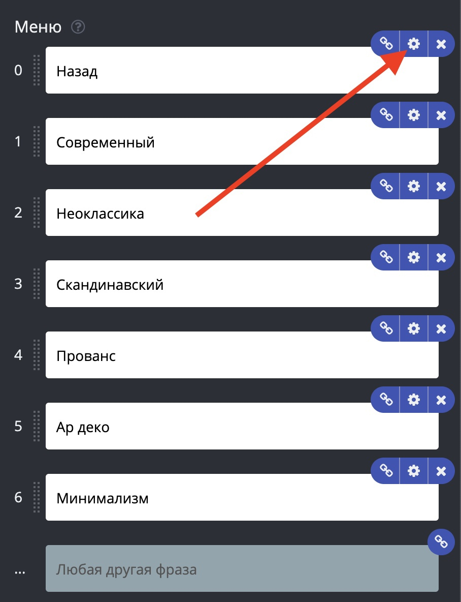

# Инлайн-кнопки Телеграм со встроенным ссылками

Для этого в окне редактирования блока добавили раздел настроек для пунктов меню.

Обратите внимание: кнопка-ссылка может вести на следующий блок, только если включить отслеживание переходов.
