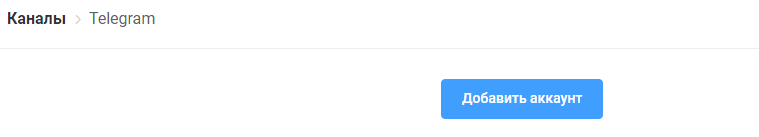
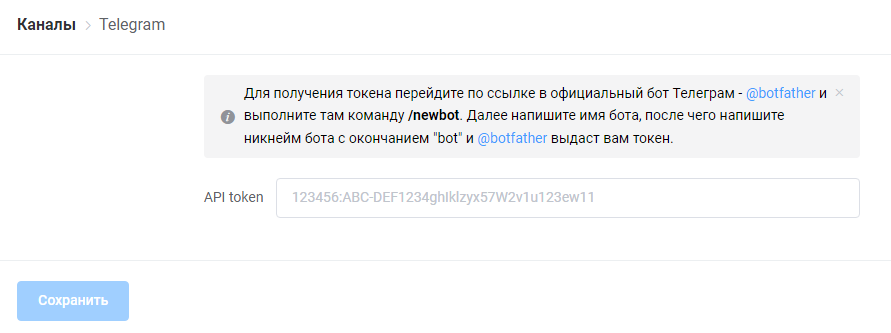
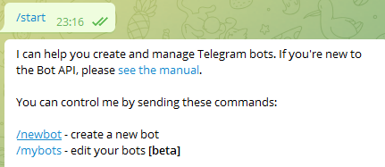
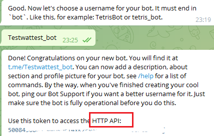

# Подключение

1\) Заходим слева во вкладку “каналы”&#x20;

.png>)

2\) выбираем нужный нам - т.е. телеграм. Нажимаем кнопку "добавить аккаунт"

3\) Далее нам требуется получить API token

4\) По кликабельной ссылке или напрямую с любого другого устройства  заходим в бот @botfather. Кликаем на команду "/newbot".

&#x20;

5\) Ответным сообщением присылаем имя вашего бота. Может быть на любом языке и не являться уникальным. В данном случае мы прислали имя "Test"

6\) Далее нас просят придумать юзенейм бота. С его помощью возможно найти бота в поиске Телеграм через команду @. Оно должно являться уникальным и заканчиваться на \_bot. В ответном сообщении вы увидите HTTP API, который нужно скопировать и вставить в форму из пункта 3.

Если вы напишите ранее занятый юзернейм, вам придёт соответствующее уведомление. В таком случае просто отправьте другой.&#x20;

.png>)
