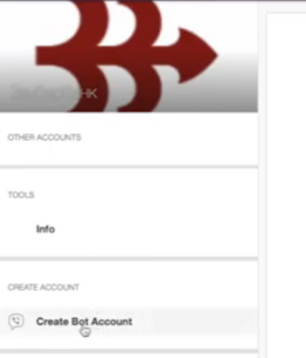

# Viber

## Как подключить Viber?

1\) Слева вкладка “каналы”,  выбираем нужный нам - т.е. Viber.

2\) Кнопка добавить аккаунт.&#x20;

.png>)

3\) Переходим по кликабельной ссылке Viber Admin Panel. Регистрируемся там.&#x20;

У вас уже должно быть установлено приложение вайбер, ваш номер и указываете в поле ввода. Получает код подтверждения и вводим его.

4\) Слева появляется панель “create bot account”.&#x20;

При желании можно загрузить картинку. Заполняем все выпавшие поля. Проставляем внизу все галочки и нажимаем кнопку “create”. Получаем токен, копируем его и вводим на вкладке канала.

.png>)

Как создать и подключить бота в Viber:


