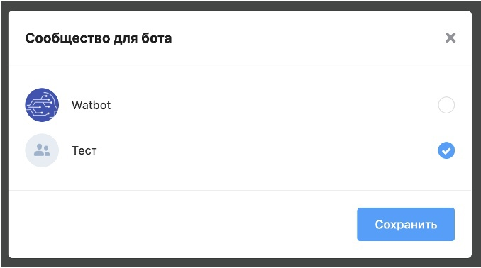
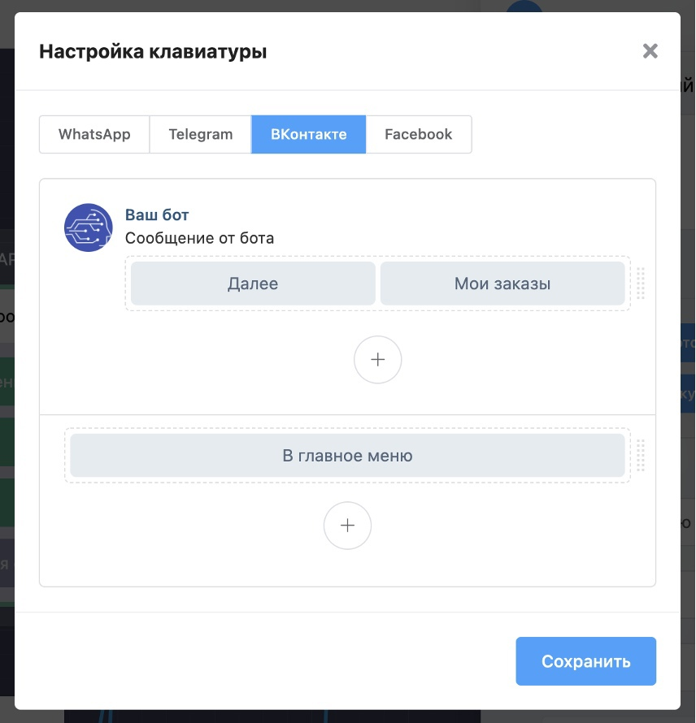

# VK

Наша платформа позволяет создавать ботов для ВКонтакте! Просто привяжите ваш аккаунт ВКонтакте и выберите страницу для бота.

#### Редактор клавиатуры

Боты ВКонтакте поддерживают кнопки, а мы со своей стороны сделали поддержку редактора этих кнопок.

**Требования к клавиатуре со стороны ВК:**

* Максимальный размер стандартной клавиатуры — 5×10.&#x20;
* Максимальное количество кнопок: 40.
* Максимальный размер инлайн клавиатуры — 5×6.&#x20;
* Максимальное количество кнопок: 10.
* Строка содержащая кнопку со ссылкой должна содержать не более двух кнопок.


[dobavlenie-kanala-vkontakte.md](dobavlenie-kanala-vkontakte.md)

