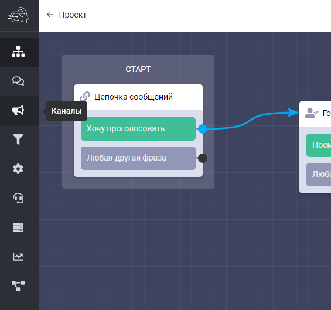
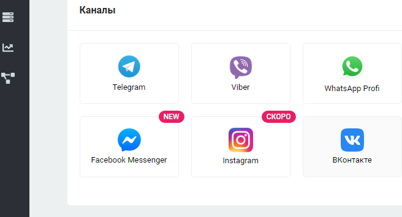
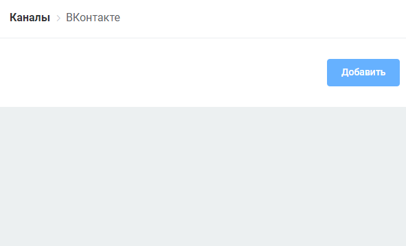
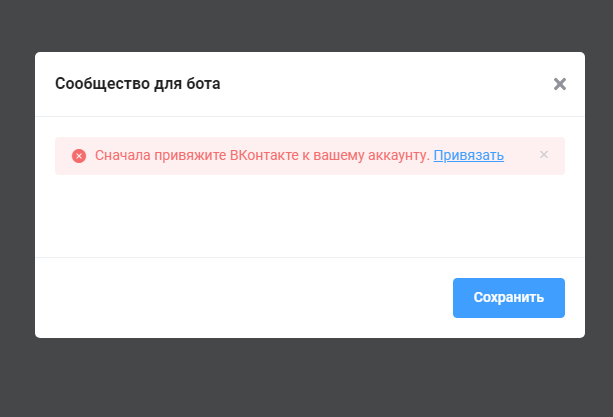
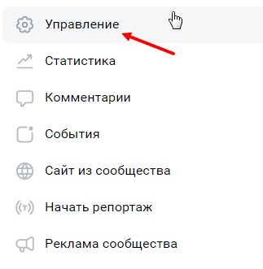
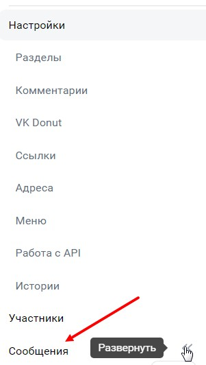
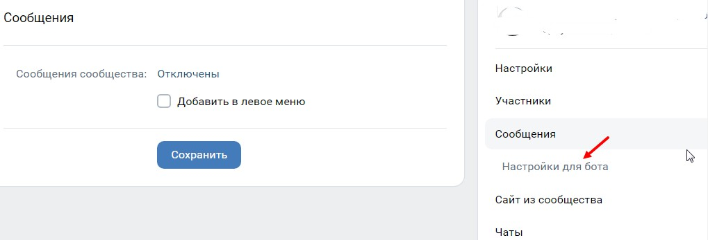
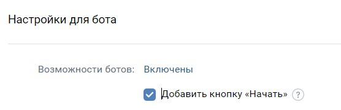

# Добавление канала Вконтакте

1\) Выбираем слева вкладку “каналы”&#x20;

2\) Выбираем нужный нам канал - т.е. Вконтакте&#x20;

3\) Нажимаем кнопку добавить

4\) Нас попросят привязать аккаунт Вконтакте. Нажимаем кликабельную ссылку привязать.&#x20;

5\) Переходим по ссылку, внизу видим подпись “социальные сети” и кнопка “вконтакте”. Нажимаем её. На всплывающем окне нажимаем кнопку “разрешить”.

Если при входе в бот вк не приходит стартовое сообщение, протестируйте отправку другого стартового блока, например, текст без кнопок. Для перезагрузки бота вк (т.е. перепрохождения с начала) отправьте команду 000. Если сообщение без кнопок приходит, а с кнопками нет, значит в вк не активировалась функция чат-ботов. Для этого в вк зайдите в сообщество, которое вы планируете подключить к боту. Справа перейдите в раздел управление:

<figure><figcaption></figcaption></figure>

Внутри откройте раздел сообщения:

<figure><figcaption></figcaption></figure>

И перейдите в подраздел "настройки  для бота" :

<figure><figcaption></figcaption></figure>

И включите возможности ботов:

<figure><figcaption></figcaption></figure>
