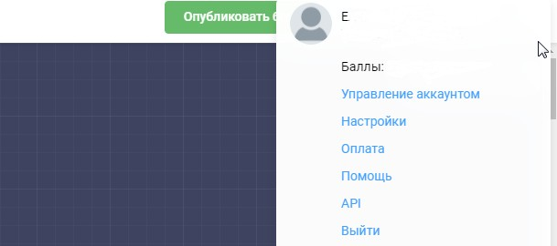
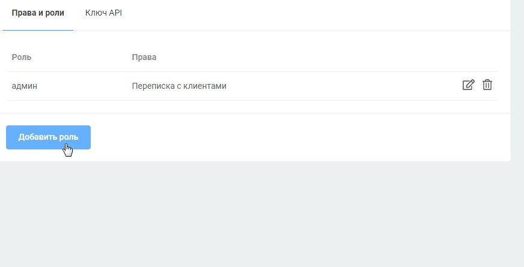
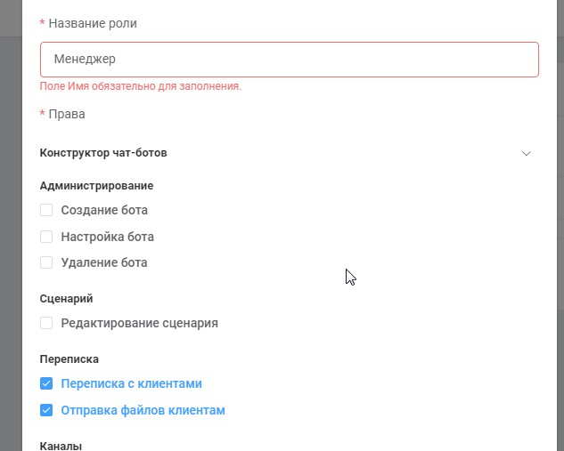
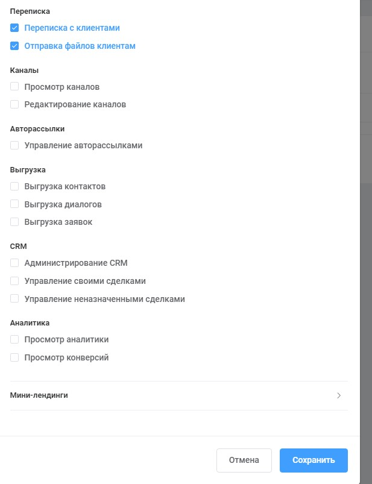
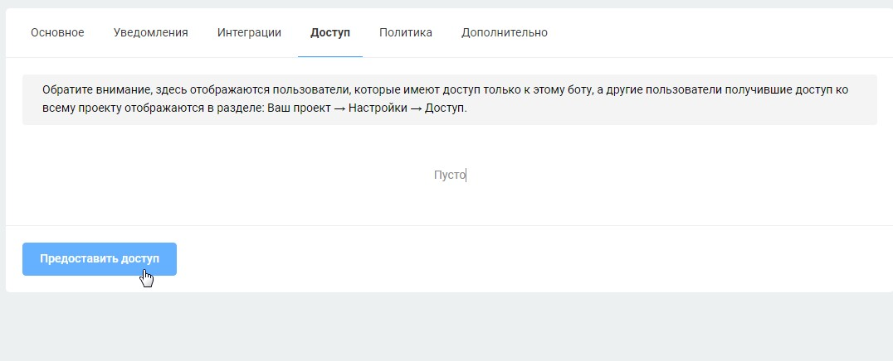
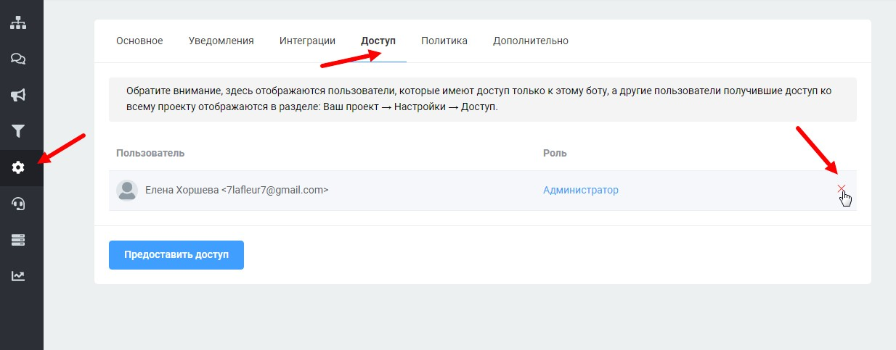

# Права и роли

Если вам требуется, чтобы у вашего сотрудника были ограниченные права, вы сами можете настроить доступ. Обратите внимание, что аккаунт, которому предоставляете должен быть быть оплачен (по минимальному тарифу).

Для этого сначала необходимо создать роли. Вы можете создать разные роли с разными правами для разных сотрудников. Для этого кликните вверху на иконку рядом с вашей аватаркой и перейдите в раздел настройки:

<figure><figcaption></figcaption></figure>

Нажмите на кнопку "добавить роль", напишите название, отметьте нужные боксы и нажмите "сохранить":

<figure><figcaption></figcaption></figure>

<figure><figcaption></figcaption></figure>

<figure><figcaption></figcaption></figure>

После создания роли можно выдать доступ нужному сотруднику. Для этого&#x20;

* в левой панели зайдите в раздел "настройки", "доступ",&#x20;
* нажмите на кнопку "предоставить доступ",
* &#x20;в открывшемся окне введите почту, по которой у нас на платформе зарегистрирован ваш сотрудник,&#x20;
* выберите одну из созданных вами ролей,
* нажмите "отправить приглашение".

<figure><figcaption></figcaption></figure>

После этого вашему сотруднику придёт письмо со ссылкой, по которой он должен перейти из браузера, в котором он залогинен на нашей платформе. Если письма нет в папке "входящие", проверьте папку "спам" и другие папки.

Чтобы проверить кто имеет доступ к вашему аккаунту, зайдите в раздел "настройки", "доступ" и вы увидите весь список. Там же вы можете отозвать доступ:

<figure><figcaption></figcaption></figure>



