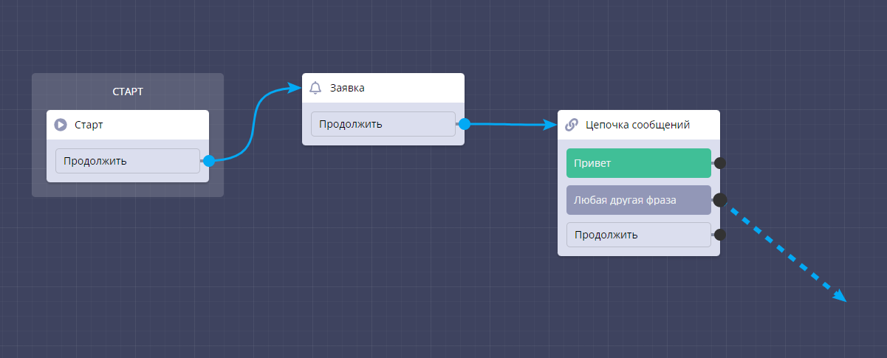
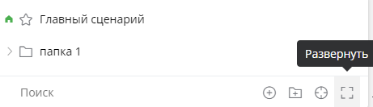
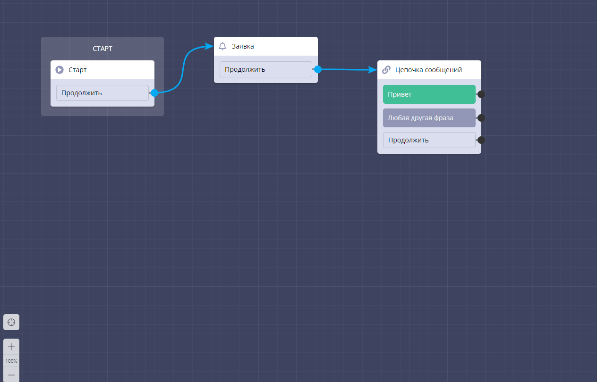

# Сценарий чат-бота

После создания чат-бота вы попадаете в основной сценарий.&#x20;

<figure><figcaption>
Основной сценарий бота
</figcaption></figure>

В нем по умолчанию располагаются 3 стандартных блока: стартовый, заявка, цепочка сообщений. Их можно модифицировать или удалить.

Стартовый блок можно только скопировать, удалить его нельзя. Функция "скопировать" отправляет блок в буфер обмена, его можно вставить в основной или дополнительный сценарий; функция "создать копию" копирует блок в основной сценарий сразу же.

Остальные блоки можно удалить, копировать и создавать их копию.

Для того, чтобы отредактировать наполнение блока, нужно на него нажать. Справа откроется окно редактирования блока. У каждого блока оно разное.

<figure><figcaption>
Функционал блока цепочка сообщений
</figcaption></figure>

Между блоками можно устанавливать связь с помощью голубых стрелок, для этого необходимо перетянуть стрелку из одного блока в другой/ из конкретного ответа в другой ответ/ из ответа в блок. Связи между блоками можно удалять, наведя курсор на нужную стрелку и нажав на корзину.&#x20;

<figure><figcaption>
Сплошная стрелка - связь есть, пунктирная - связь устанавливается
</figcaption></figure>

<figure><figcaption>
Удаление связи между блоками
</figcaption></figure>

Для того, чтобы добавить новый блок в сценарий, необходимо нажать на кнопку "добавить блок" в правом верхнем углу, затем выбрать необходимый.&#x20;

<figure><figcaption>
Добавление нового блока
</figcaption></figure>

<figure><figcaption>
Выбор блока
</figcaption></figure>

На базовом тарифе доступны не все блоки, но даже с помощью них можно создать бота, который будет функционировать. На тарифе PRO доступны все виды блоков.&#x20;

Мы работаем в главном сценарии. В правом нижнем углу можно его отредактировать или скопировать. Помимо главного сценария можно добавить дополнительные. Для этого необходимо нажать кнопку "главный сценарий" в правом нижнем углу.&#x20;

<figure><figcaption>
Выбор и создание сценария
</figcaption></figure>

Затем на "+" и назвать дополнительный сценарий

<figure><figcaption>
Добавление нового сценария
</figcaption></figure>

<figure><figcaption>
Главный и дополнительный сценарий
</figcaption></figure>

Дополнительный сценарий можно скопировать, переименовать, сделать главным, настроить и удалить

<figure><figcaption>
Редактирование дополнительного сценария
</figcaption></figure>

Для структурирования сценариев можно создавать папки и добавлять в них сценарии. Чтобы создать папку, нужно нажать на значок папки с плюсом и назвать папку.&#x20;

<figure><figcaption>
Создание папки
</figcaption></figure>

Папку также как и сценарий можно редактировать: создать копию, переименовать, добавить в нее новый сценарий и новую папку, а также удалить

<figure><figcaption>
Редактирование папки
</figcaption></figure>

В папку можно добавить ранее созданные сценарии, для этого необходимо перетащить их в папку. При удалении папки, удалятся все сценарии, находящиеся в ней.

<figure><figcaption>
Сценарий в папке
</figcaption></figure>

Кнопка "найти текущий сценарий" ищет сценарий в котором вы сейчас находитесь, среди папок и других сценариев, даже в свернутом виде этого меню

<figure><figcaption>
Найти текущий сценарий
</figcaption></figure>

Кнопка "развернуть" показывает список всех сценариев во всех папках, при повторном нажатии сворачивает, оставляя только иконки и названия папок

<figure><figcaption>
Развернуть
</figcaption></figure>

Для удобства создания бота по полю сценария можно передвигаться с помощью мыши или кнопок слева снизу. Кнопка "прицел" переносит из любого места в сценарии к стартовому блоку. Кнопки "+" и "-" увеличивают и уменьшают рабочую область.&#x20;

<figure><figcaption>
Кнопки зум и прицел слева снизу
</figcaption></figure>

Как работать с разными сценариями смотрите в нашем ролике:


