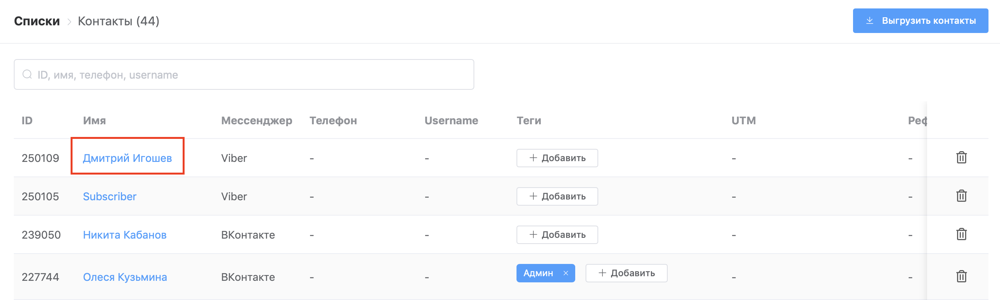
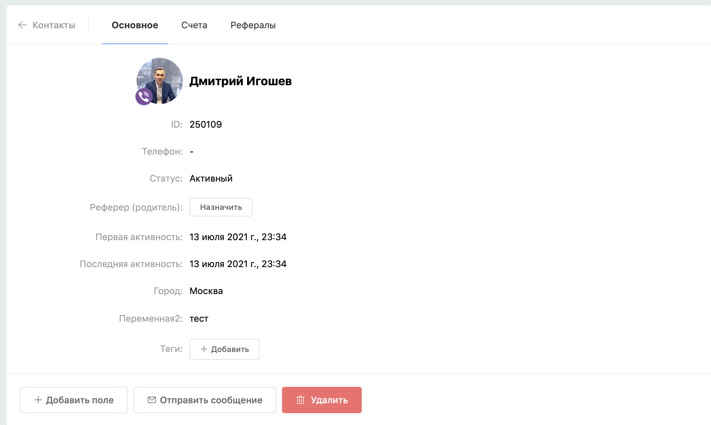
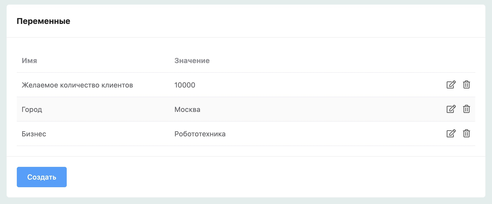

# Пользовательские переменные


**Пользовательская переменная -** переменное значение, которое заполняется пользователем. Переменные вы можете создать в окне редактирования блока сценария.


### Куда передаются данные из пользовательских переменных?

Они сохраняются до тех пор пока не создастся заявка и отправится уведомление, в котором они будут указаны

### `{{$ИмяПеременной}}` - Подставить пользовательскую переменную в сообщение

## Сравнение переменных пользователей

На данный момент в блоке "условие" нельзя сравнить локальную переменную с глобальной.

## Сохранение переменных пользователя&#x20;

В блоках Простое сообщение и Цепочка сообщений вы можете сохранять ответы пользователей в переменные. Для этого необходимо придумать название переменной и написать его в нижней части настроек блока включив галочку "Записать ответ в пользовательскую переменную".

.png>)

#### Выборочное удаление пользовательских переменных после создания заявки

## Редактирование переменных пользователя

Допустим вы делаете небольшой квест с начислением баллов за выполнение заданий. Вручную редактировать переменную необходимо чтобы начислять баллы за действия, которые бот не может учесть, например за фото с хэштегом в соц.сетях и т.п.

Чтобы вручную редактировать переменные мы заходим в раздел Списки->Контакты

Нажимаем на значение переменной, после чего можно редактировать

Если перейти в **вашего бота** → **Списки**→ **Контакты → Контакт**, то в разделе **Переменные** вы увидите список всех пользовательских переменных назначенные текущему пользователю.

Для удобства при редактировании имени переменной подгружается список существующих переменных для быстрого заполнения.

#### Выборочное удаление пользовательских переменных после создания заявки 

Для этого необходимо отмечать отдельно каждую пользовательскую переменную, которую вы хотите удалить после создания заявки.

.png>)

В разделе «списки» находятся подсказки по пользовательским переменным. Можно удалять подсказки массово или выборочно. Следует учитывать, что удаление переменных из этого списка не удаляет их у контакта.

.png>)

Помимо пользовательских переменных существуют глобальные переменные. Они не уникальны и действуют по отношению ко всем пользователям. Они не выводятся в карточке контакта, их можно увидеть в разделе "списки".




