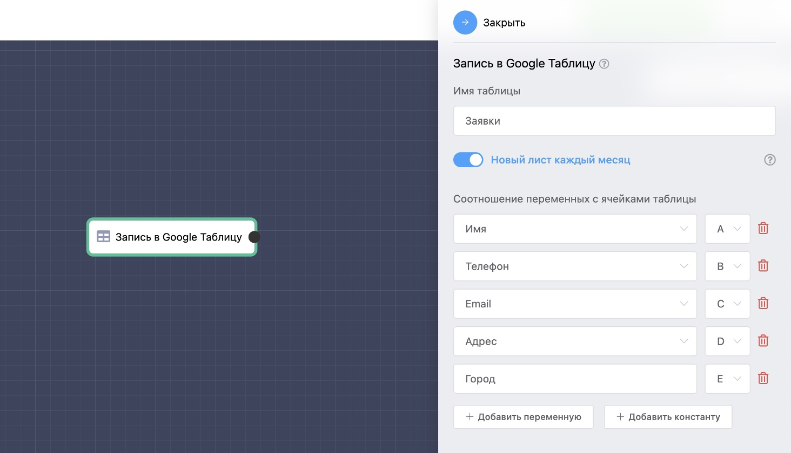

# Запись в Google Таблицу

Возможность записывать данные пользователя в Google Таблицу, для этого просто сопоставьте данные пользователя с ячейками таблицы. Если включить опцию «Новый лист каждый месяц», то платформа будет создавать новый лист в таблице в начале каждого месяца, а в начале нового года создаст новый файл таблицы.

В таблицу можно сохранять пользовательские переменные, а также следующие константы:

* ID
* ID мессенджера
* Username
* Имя
* Телефон
* Email
* Адрес
* Дата создания&#x20;
* Referrer ID

Возможно выбрать существующую таблицу на диске.&#x20;

<figure><figcaption></figcaption></figure>

Таблицу на стороне Google можно редактировать как угодно, данные будут вставляться в конец таблицы. Поиск конца таблицы происходит по столбцу А, поэтому позаботьтесь от том, чтобы оно участвовало в формировании данных.

Файл таблицы можно переименовывать и перемещать по диску.


