# Комбинирование блоков

На нашей платформе доступно 60 различных блоков, которые можно комбинировать между собой. Здесь вы найдёте варианты комбинаций, которые могут вам пригодится при сборке бота

#### 1) Сборы данных подписчиков

_Цепочка сообщений + запись в Google таблицу или добавление записи в список_&#x20;

Если вам требуется сохранить ответы пользователей, то включите в цепочке сообщений бегунок "записывать ответы в пользовательскую переменную", дайте ей название. Вы можете поставить несколько блоков "цепочка сообщений подряд" соединив их по связи "любая другая фраза" если надо сохранять то сообщение, которое пишут пользователи или по связям от кнопок если надо сохранять названия из меню. Далее добавьте блок запись в Google таблицу (предварительно вам необходимо интегрировать ваш Google аккаунт с нашей платформой) или добавление записи в список (предварительно необходимо создать список). После этого всего ответы пользователей будут передаваться либо в google таблицу, либо в список нашей платформы (данные можно скачать в виде excel таблицы).&#x20;

<figure>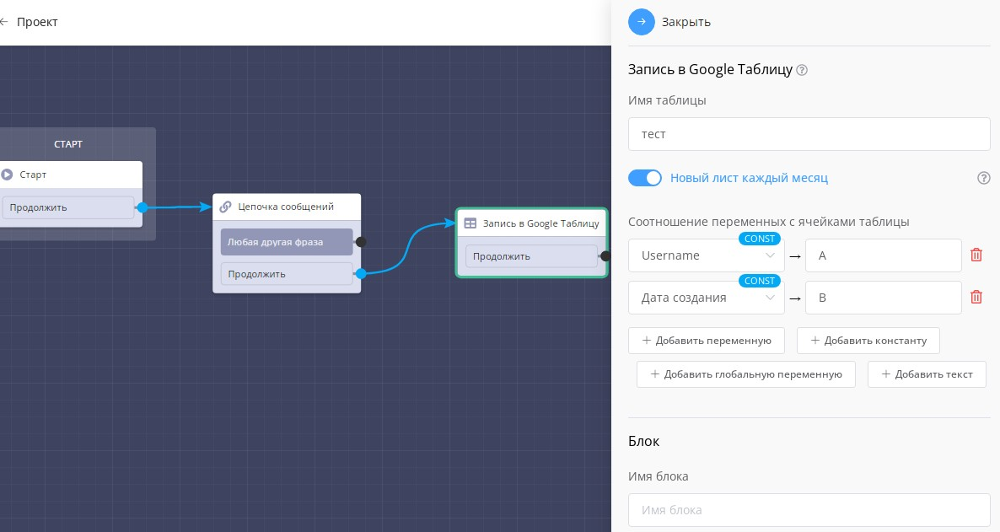<figcaption></figcaption></figure>

#### 2) Напоминание если пользователь не нажал никакую кнопку

_Цепочка сообщений + назначать тег (от кнопок) + задержка (от связи продолжить) + условие "проверка по тегу" + цепочка сообщений_

Если вам требуется напомнить пользователю что он воспользовался меню на каком этапе, то это можно сделать следующим образом. После кнопок меню вы назначаете тег (например, "нажал"). А от связи "продолжить" вы ставите блок "задержка" на то количество времени, через которое хотите отправить напоминание. Далее добавляете блок "условие" и делаете проверку по тегу (в нашем примере "нажал"). По условию "да" ничего не ставите, значит, пользователи нажали кнопки меню и им не требуется напоминание. По условию "нет" добавляете напоминание, т.к. если тега нет, значит кнопки не были использованы.&#x20;

<figure>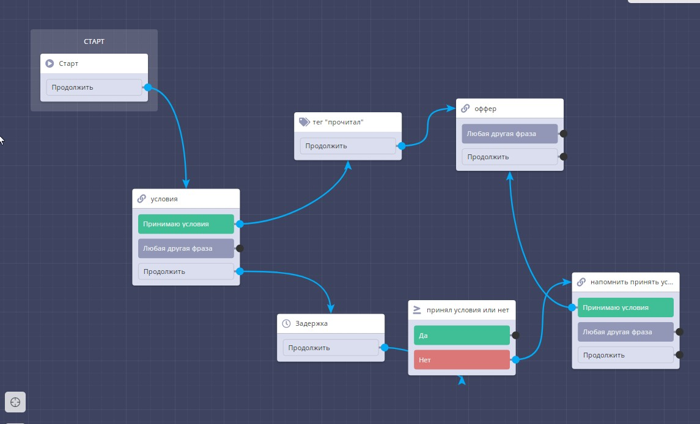<figcaption></figcaption></figure>

#### 3) Вход в чат-бот по паролю

_Цепочка сообщение + условие (сообщение совпадает с текстом)._&#x20;

Любой пользователь может найти бот по username и нажать старт. Но можно ограничить дальнейшее перемещение по сценарию. Для этого попросите в блоке "цепочка сообщений" ввести пароль, от связи "любая другая фраза" ведёте на блок условие,  где по "сообщение совпадает с текстом" проверяете корректность введенного пароля. По связи "да" отправляете далее  по сценарию, значит пароль введен верно. По связи "нет" уведомляете о том,  что пользователей отправил неверный пароль. Для этого опять используем блок цепочка сообщений. И также можно предложить ввести пароль заново и поставить связь обратно на условие.&#x20;

<figure>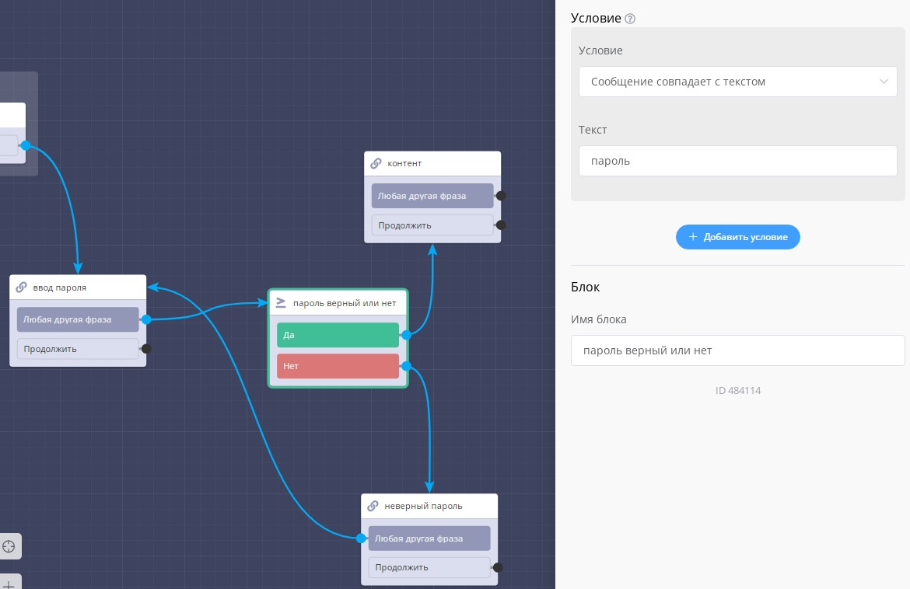<figcaption></figcaption></figure>

#### 4) Уведомления о новых пользователях

_блок "старт" + блок "заявка"_

Если вы хотите знать, что кто-то зашёл в ваш чат-бот, то добавьте сразу после блока "старт" блок "заявка", указав на какой канал связи вы хотите получать уведомления.&#x20;

<figure>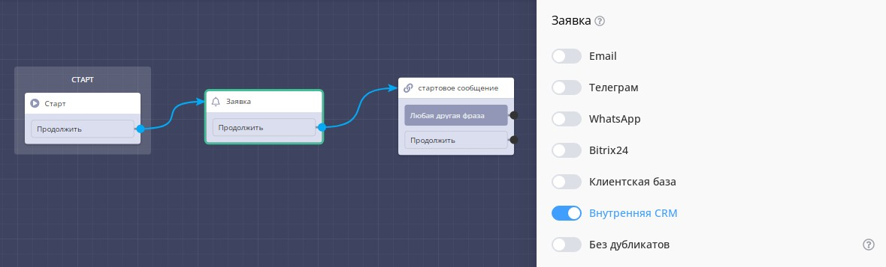<figcaption></figcaption></figure>

#### 5) Добавление заявки на нужный этап crm

_Цепочка сообщений + этап сделки._&#x20;

Подходит для чат-ботов с кэшбеком. Например, сначала вы просите прислать скриншот отзыва. После отправки через блок "этап сделки" отправляете заявку на этап "скриншот отправлен". Далее в срм менеджер разбирает все заявки с данного этапа, проверяет что всё верно и если да, отправляет кэшбек.&#x20;

<figure>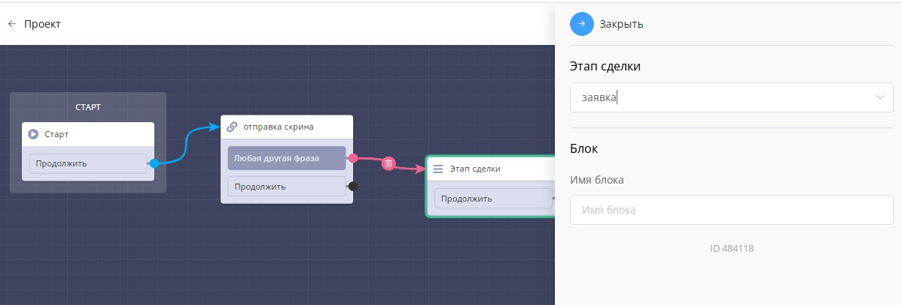<figcaption></figcaption></figure>

#### 6) Если у вас накопилось очень много блоков на одном сценарии

_Цепочка сообщений + сценарий_

Чтобы не добавлять все блоки бота на карту одного сценария создайте несколько сценариев, например, в соответствии с разбелами меню. А далее от кнопок меню ставите блок "сценарий", ведете на соответствующий сценарий и уже там собираете бот далее по заданию.&#x20;

<figure>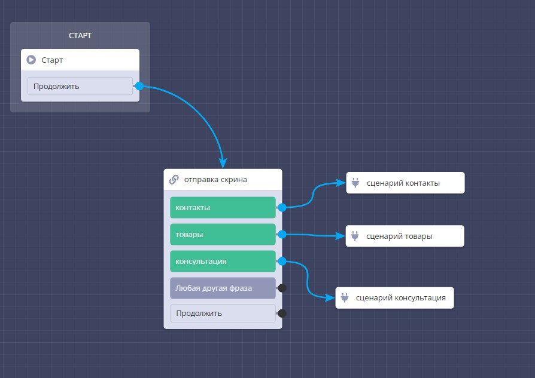<figcaption></figcaption></figure>

#### 7) Удалить ненужных пользователей из бота

_Цепочка сообщений + задержка +.удалить пользователя из бота_

Если бот создан для какой-то конкретной задачи, например, оплата мероприятия, то в самом первом блоке по связи "продолжить" ставите блок "задержка" на нужное вам количество дней. А после него блок "удалить пользователя из бота". Через месяц после удаления такие пользователи перестанут учитываться в счетчике тарифа.&#x20;

<figure>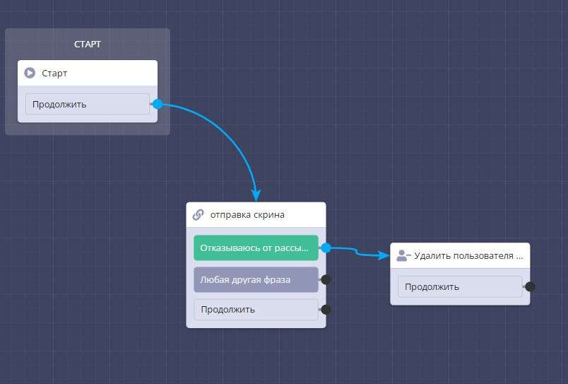<figcaption></figcaption></figure>

#### 8) Проверка ввода кода для розыгрыша  приза&#x20;

_Цепочка сообщений + проверка существования записи в списке + цепочка сообщений_

Вы заранее создаете список и загружаете туда список кодов. Далее через блок "цепочка сообщений" запрашиваете его и по связи "любая другая фраза" ведёте на "проверка существования записи в списке)  (т.е. отправленного кода). По связи "существует" через блок "цепочка сообщений" добавляете уведомление о получении приза, потому что если запись существует, значит код введен неверно. Соответственно, по связи "не существует" уведомляете о том, что пользователь ввёл неверный код.&#x20;

<figure><figcaption></figcaption></figure>

#### 9) Отправка рандомного приза с возможностью настроить процент вероятности выпадения

_Цепочка сообщений + а/б тестирование + цепочка сообщений._&#x20;

В блоке "цепочка сообщений" делаете кнопку, например,  "хочу приз" и ведёте от неё к блоку "а/б тестирование". Там вы настраиваете сколько вариантов призов будет и от них ведёте связь к блоку "цепочка сообщений" с соответствующим подарком.&#x20;

<figure>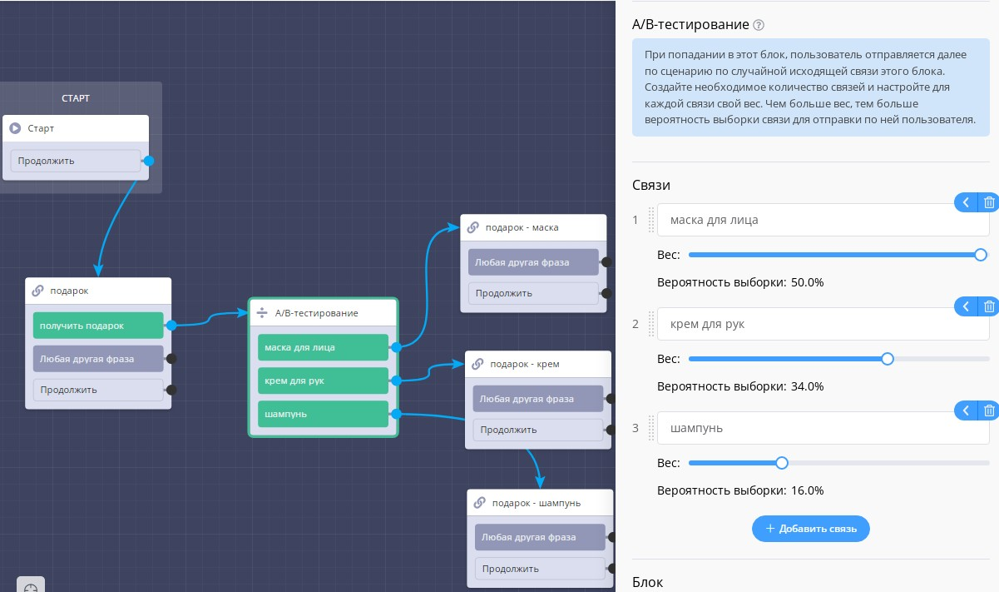<figcaption></figcaption></figure>

#### 10) Начисление баллов за ответы

_Цепочка сообщений + операция над переменной._&#x20;

Если вы хотите сделать тест, где будете начислять баллы за верные ответы, то добавьте блок "цепочка сообщений" с несколькими вариантами ответа. От правильного ответа ведёте связь с блоку "операция над переменной", где указываете, сколько баллов должно быть начислено. А уже от него к следующему блоку "цепочка сообщений ".

<figure>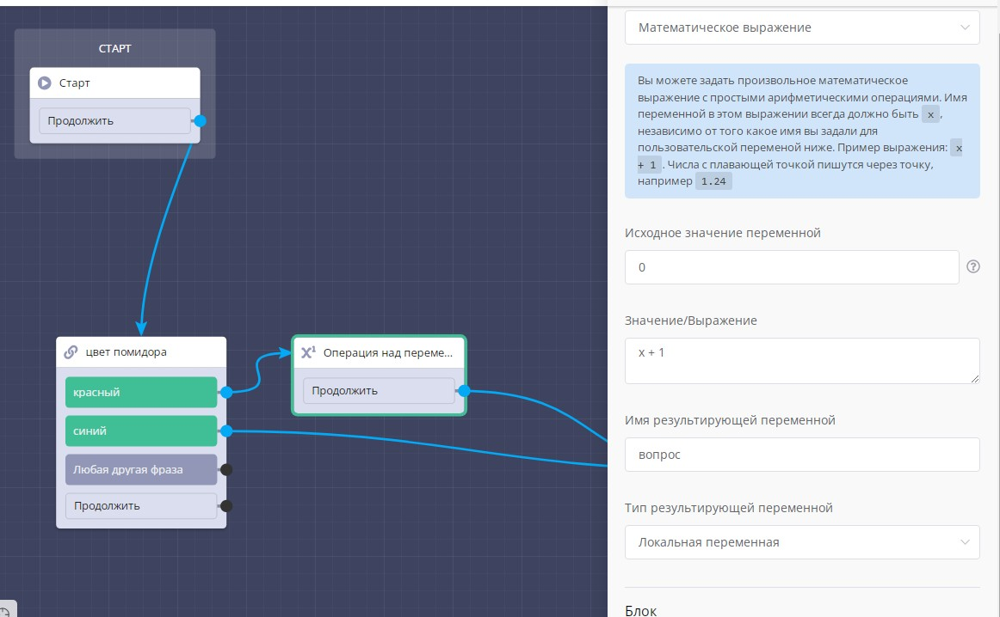<figcaption></figcaption></figure>

#### Блок условие может ставится за блоком условие и переключателем

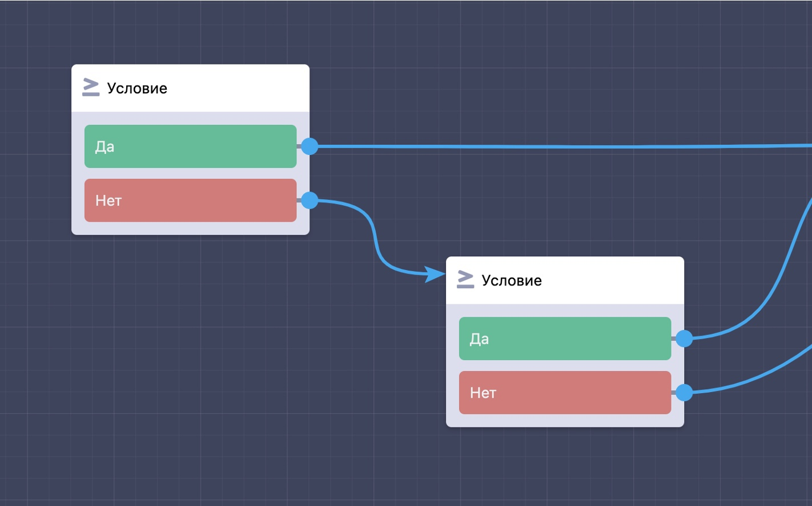

Чтобы случайно не зациклить сценарий и не потратить все ресурсы вычислительных мощностей наших серверов, наша платформа обрабатывает не более **4-х блоков** подряд стоящих друг за другом в цепочке. В будущем этот лимит может измениться.

#### Блок таймер + блок условие

Блок таймер можно использовать с другими блоками, особенно полезна связка с блоком условие. Когда таймер истечет, клиент отправится в следующий блок через блок условие.

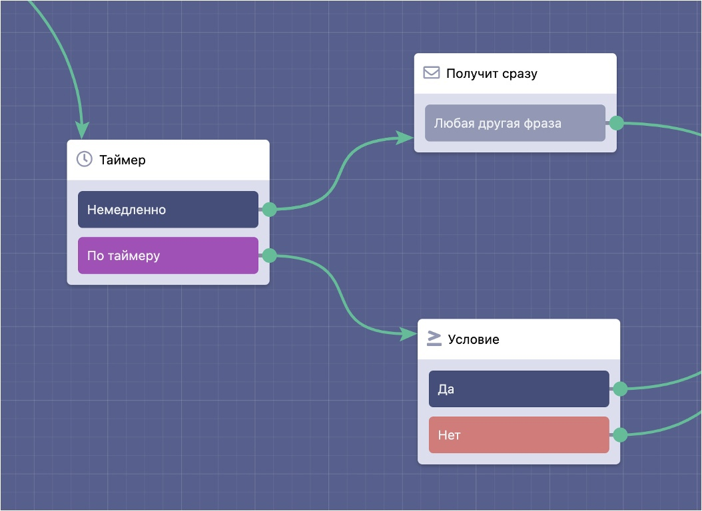

#### Блок таймер + блок таймер

Для создания цепочки авторассылки используйте связку блок таймер + блок таймер.

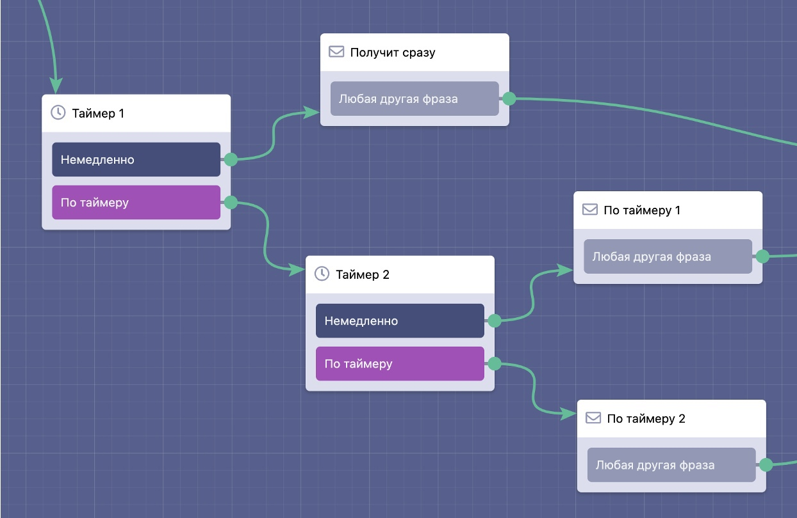

