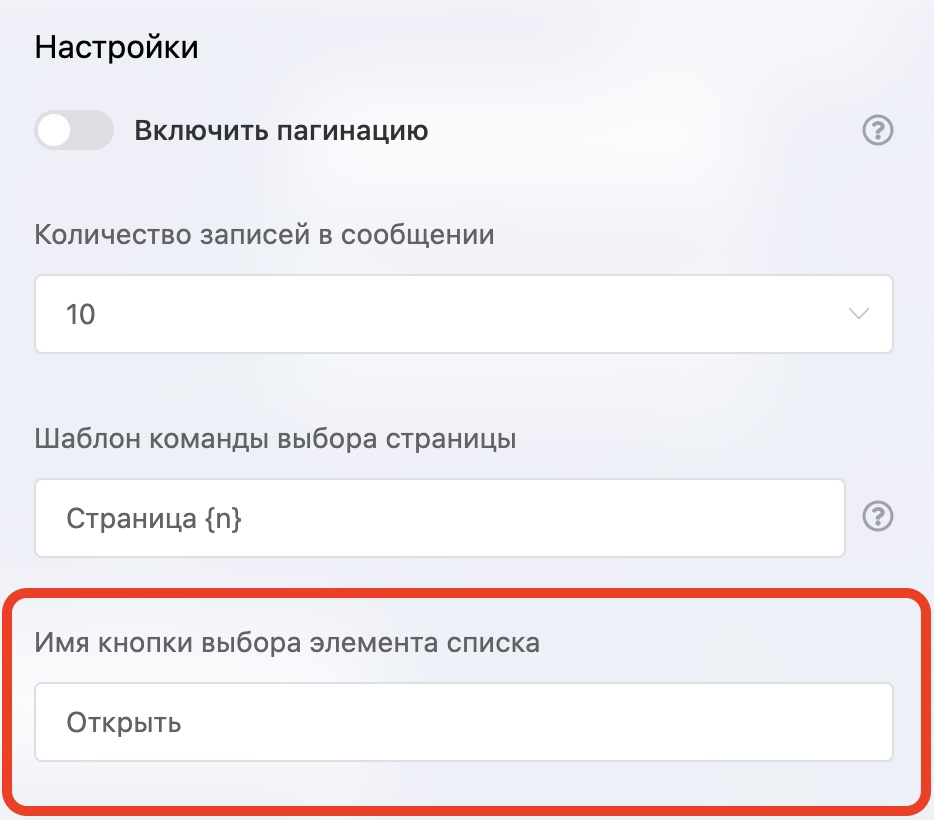

# Редактирование кнопки выбора элемента списка

Откройте блок «Чтение записей из списка» и задайте имя кнопки. Это актуально для мессенджеров с поддержкой инлайн-кнопок, например в Телеграм, когда бот отправляет список (товаров) пользователю, под каждой записью отображается кнопка, которую теперь можно редактировать.

