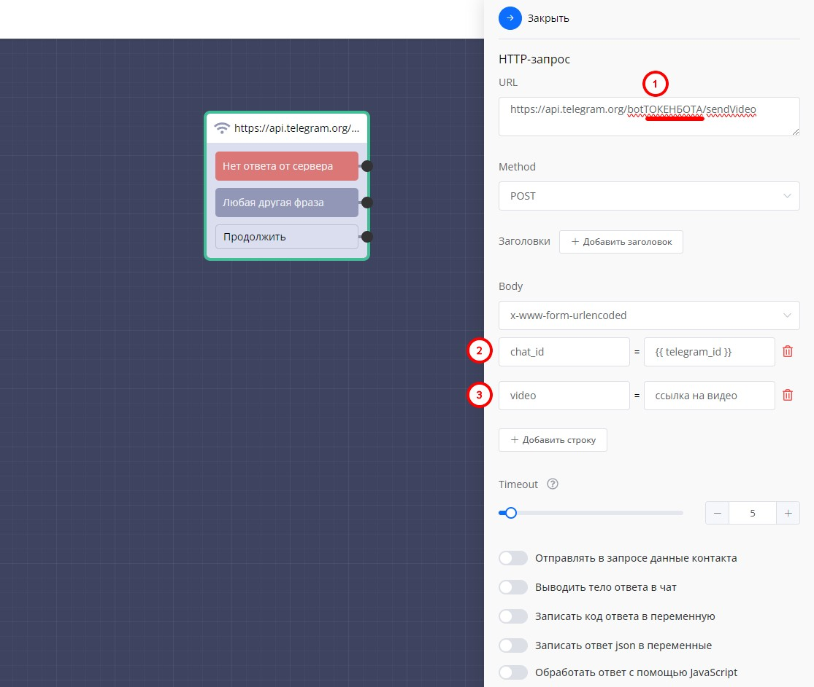

# Отправка видео

Как отправить видео любого размера.

<figure><figcaption></figcaption></figure>

**Создайте блок** **HTTP-запрос с запросом** [**https://api.telegram.org/botТОКЕНБОТА/sendVideo**](https://api.telegram.org/bot%D0%A2%D0%9E%D0%9A%D0%95%D0%9D%D0%91%D0%9E%D0%A2%D0%90/sendVideo)\
\
**Настройки для блока:**

Метод POST

1. Токен бота
2. chat\_id = \{{ telegram\_id \}}
3. video = ссылка на ваше видео из открытого источника. YouTube (но возможны ограничения), собственный telegram канал (ссылка на загруженный файл).
