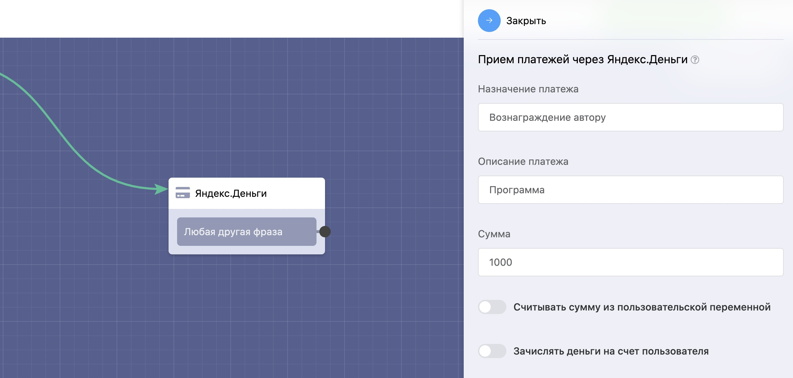

# ЮМани(Яндекс.Деньги)

####

Данный блок позволяет принимать оплату физ. лицам на свой кошелек в Яндекс.Деньги. После совершения платежа можно настроить автоматическое действие бота, например отправить ссылку на онлайн курс.

### Теги после оплаты в блоке «Яндекс.Деньги»

В блоке **«Яндекс.Деньги»** появилась возможность пометить тегами оплативших клиентов.

Подробнее о подключении Юmoney:


