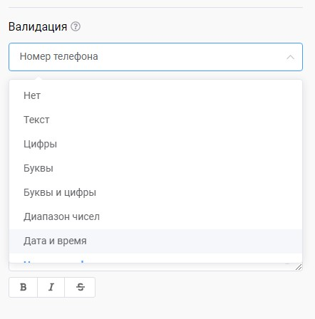
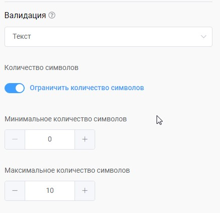

# Валидация

> **Валидация** - проверка введенных данных пользователя на соответствии указанному формату. Если валидация считается не пройденной, клиенту возвращается сообщение об ошибке с просьбой повторить введение данных в корректном формате. Валидация активируется когда нет совпадений по пунктам меню.

<figure><figcaption></figcaption></figure>

## На данный момент поддерживаются следующие типы валидации: 

* **Текст** - любой текст
* **Цифры** - только цифры
* **Буквы** - только буквы
* **Буквы и цифры** - только буквы и цифры
* **Диапазон чисел** - диапазон чисел в рамках указанных значений
* **Дата и время** - дата и время по заданному шаблону
* **Номер телефона** - номер телефона в международном формате
* **Email** - адрес электронной почты
* **URL** - ссылка на сайт или его страницу
* **Картинка** - файл картинки
* **Регулярное выражение** - этот тип валидации для профессионалов, который позволяет проверить любой формат введенных данных. Для его настройки попросите знакомого программиста помочь вам или обратитесь в службу поддержки. Пример регулярного выражения для проверки на число: `^\d+$`

## Ограничение по количеству символов 

Вместе с типом валидации вы при необходимости можете настроить ограничение на количество символов:

<figure><figcaption></figcaption></figure>

## Собственное сообщение об ошибке 

Сообщение об ошибке формируется системой в соответствии типу валидации. Также имеется возможность задать свое собственное сообщение об ошибке.

.png>)


