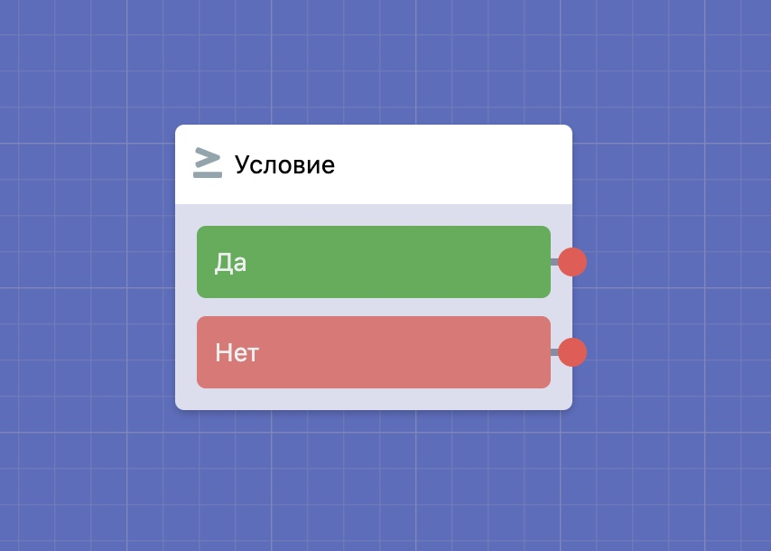
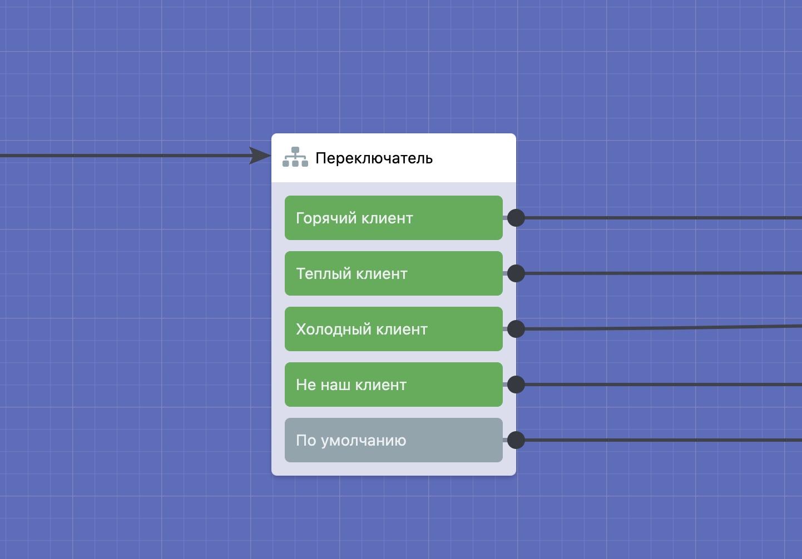
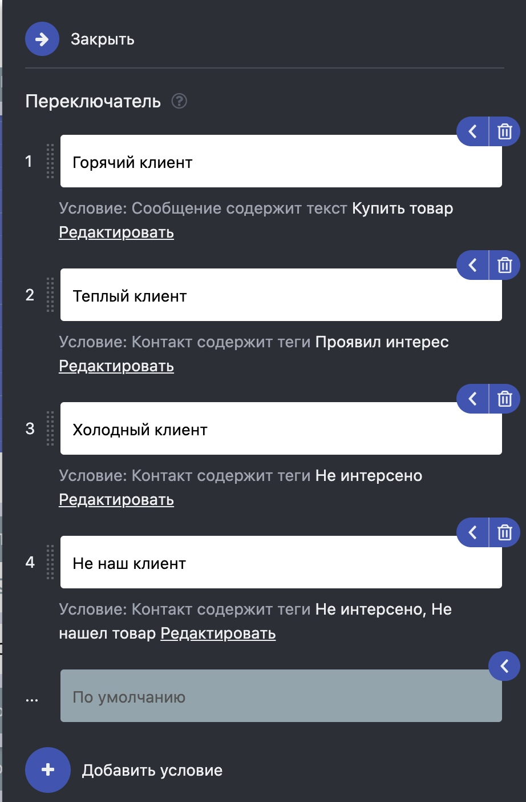

# Переключатель

Иногда требуется распределить трафик пользователей по разным веткам сценария исходя из каких-то условий, для этого вы можете воспользоваться блоком [Условие](https://vk.com/@watbot-novyi-blok-uslovie). Но в таком случае направить трафик возможно только по двум веткам, клиент подходит под условие, либо не подходит.

Перед нами встала задача распределить трафик пользователей по множеству веток сценария исходя из заданных условий. Для этого мы разработали новый блок **Переключатель**. Нажмите на кнопку **Добавить блок** в правом верхнем углу сценария, затем выберите этот блок во вкладке **Эксперт**.

В настройках блока вы можете добавить несколько условий.

Условия проверяются последовательно от верхнего к нижнему, срабатывает первое подходящее условие. Если ни одно условие не подошло, то срабатывает условие «По умолчанию», по тому же принципу как и «Любая другая фраза» в других блоках.

Поддерживаются следующие типы условий:

* &#x20;Сообщение содержит текст
* Сообщение совпадает с текстом
* Контакт содержит теги
* Контакт не содержит теги
* Контакт имеет установленное количество рефералов

Таким образом появилась возможность сегментировать трафик по разным сценариям, так же создавать простые разговорники опираясь на тип условия «Сообщение содержит текст».


