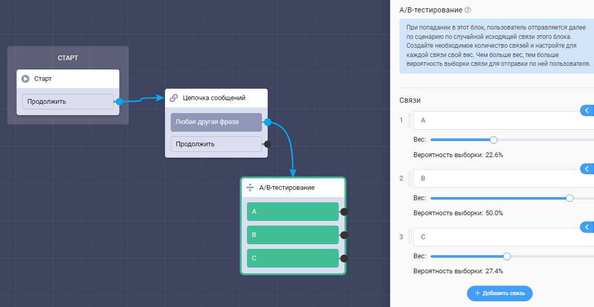

# A/B-тестирование

Данный блок позволяет распределять трафик по исходящим связям для выявления наилучшей конверсии.&#x20;

При попадании в этот блок пользователь отправляется далее по сценарию по случайной исходящей связи этого блока. Создайте необходимое количество связей и настройте для каждой связи свой вес. Чем больше вес, тем больше вероятность выборки связи для отправки по ней пользователя.


