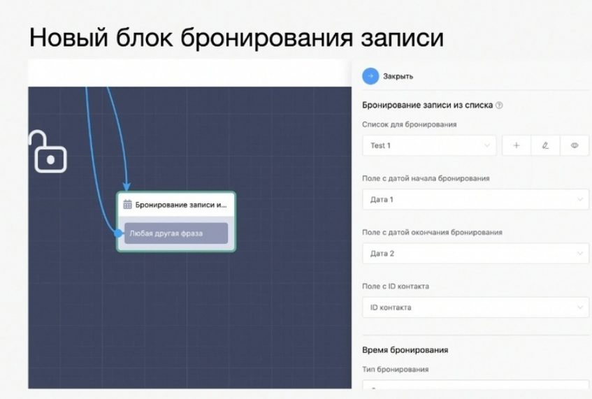
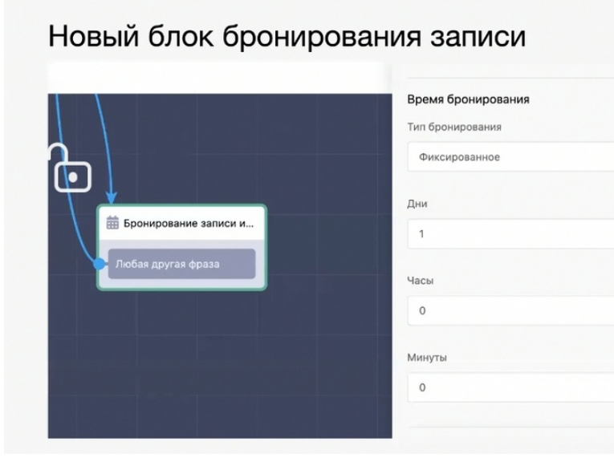
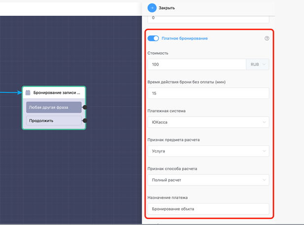
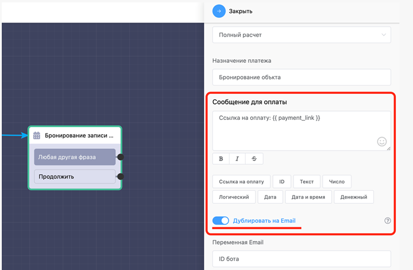

# Бронирование записи из списка

Мы создаем базу данных, например, объекты недвижимости. С помощью этого блока их можно будет забронировать на время. В настройках блока выбираете нужный список, дату и время начала/окончания бронирования и поле ID контакта. Т.е. когда контакт будет бронировать какую-то запись.

Сейчас доступен 1 тип бронирования: фиксированный. Далее их количество будет увеличиваться. В фиксированном типе указывается на сколько дней, часов и минут можно забронировать объект.

Иными словами, объект бронируется на установленное количество времени чтобы у клиента была возможность выкупить данный объект в установленное временное окно. После окончания даты конца бронирования, если оплата не была произведена, объект опять будет выводится в списке как свободный.

С помощью фильтра “дата”, назначение которого объяснялось в прошлом разделе, можно выводить только свободные, т.е. незабронированные объекты. “Дата 2” должна быть меньше текущей даты, тогда выведутся только те объекты, которые свободны.

Также можно отправить сообщение если объект уже забронирован с помощью формулы даты начала и окончания бронирования:

\{{ start\_date \}} - \{{ end\_date \}}

Важно: в этот блок должна идти связь из блока “чтение записей из списка”. Владельцы бизнеса смогут контролировать количество записей через раздел “списки”.

**Платное бронирование для блока «Бронирование записи из списка»**

Для этого переводим бегунок «платное бронирование» в активное положение, указываем стоимость, время действия брони без оплаты (через указанный промежуток время бронь отменяется в случае отсутствия оплаты), выбираем платёжную систему и данные для чека. После этого приходит ссылка на оплату.  Также вы можете настроить шаблон сообщения для оплаты нужным вам образом. Главное обязательно должна быть переменная для создания ссылки на оплату. При необходимости ссылку на оплату можно дублировать на email (он берётся из пользовательской переменной).


