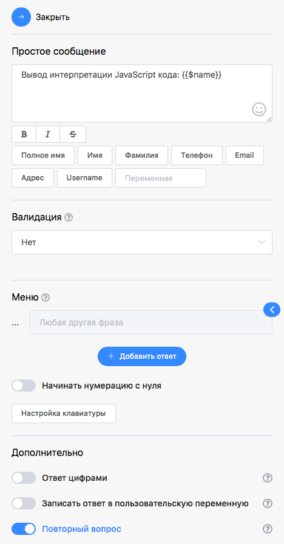

# Интерпретатор JavaScript

### **Пример интерпретации кода JavaScript**



Для установки используется специальная функция **setContactVariable**


```javascript
var name = "Watbot";
setContactVariable("name", "name")
```

<figure><figcaption></figcaption></figure>

Вывод кода Интерпретации JavaScript осуществляется через переменную <mark style="background-color:blue;">\{{$name\}}</mark>

<div data-full-width="true">

<figure><figcaption><p>Пример вывода интерпретированного кода JavaScript </p></figcaption></figure>

 

<figure><figcaption></figcaption></figure>

</div>
