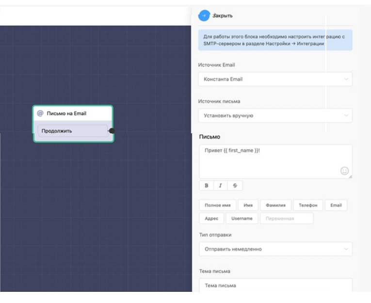

# Письмо на Email

Вы можете выбрать любой источник:

* константа – чтобы её получить сначала необходимо её запросить через блок запроса email,
* переменная (письмо отправится на email который записан в перменной),
* произвольный email.

Источником письма может быть установлен вручную или из переменной.

Для работы данного блока необходимо настроить интеграцию с SMTP-сервером.

Поле "имя рассылки": но будет отображаться в списке email рассылок. Этот список создаться в разделе списки.

