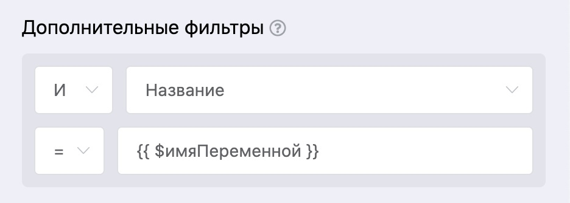

# Переменные в фильтре для блоков: Чтение записей из списка

Для блоков: **Чтение записей из списка** и **Чтение записи из списка**, добавили возможность указывать в фильтрах пользовательские переменные. Например, сначала пользователь отвечает на вопросы бота, ответы на которые записываются в переменные, а затем по этим переменным происходит поиск в [списке](https://vk.com/@watbot-novyi-blok-spiski).

