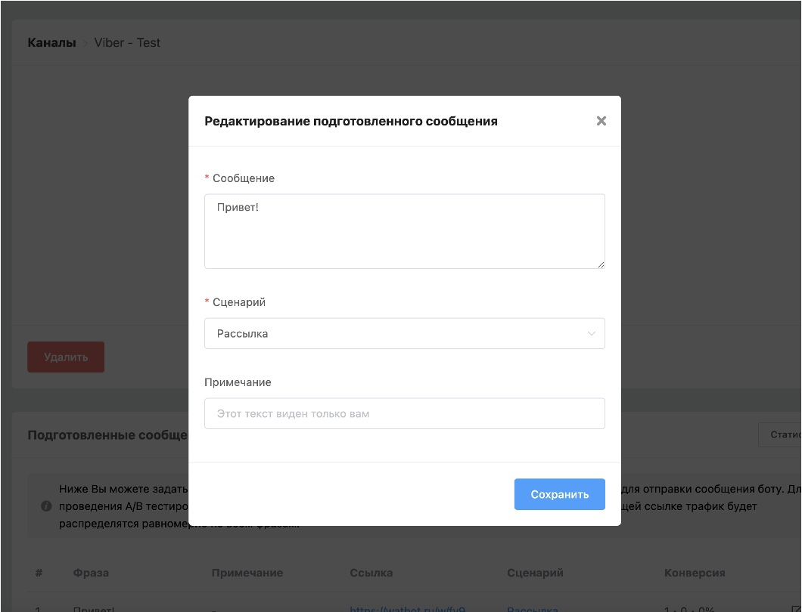

# Прямые ссылки на дополнительные сценарии

Чат-бот состоит из одного или нескольких сценариев

Сценарий чат-бота - это набор блоков сообщений и переходов по связям между ними, по которым может пройти пользователь попав по ссылке&#x20;

Дополнительный сценарий чат-бота - это **альтернативный** набор блоков сообщений и переходов по связям между ними, по которым может пройти пользователь попав по **другой** ссылке&#x20;

#### Прямые ссылки на дополнительные сценарии Viber, Whatsapp, Telegram&#x20;

Для Viber, Whatsapp, Telegram можно создавать прямые ссылки на дополнительные сценарии.

При необходимости возможно генерирование qr-кодов:

<figure><figcaption></figcaption></figure>

Как работать со сценариями в боте:


