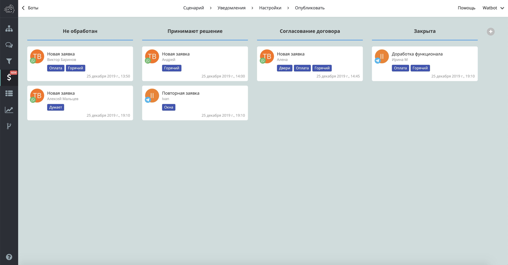
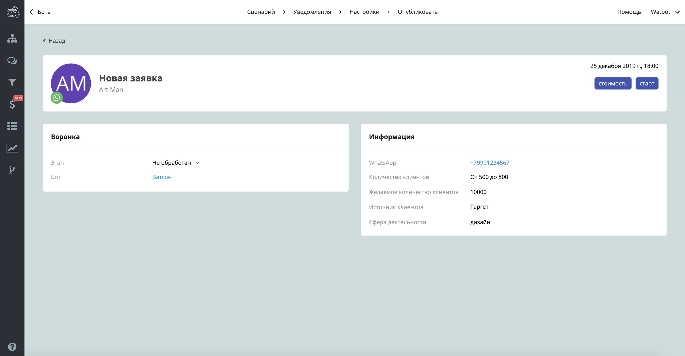

# Встроенная CRM

Какие ключевые возможности мы внедрили на старте системы:

* Сделка содержит контакт пользователя, теги контакта, пользовательские переменные заполненные до создания сделки
* Вы можете редактировать название сделки, этап, дополнительные поля
* Вы можете перемещать карточки сделок из одного этапа в другой
* Вы можете перемещать этапы воронки по горизонтали (новые сделки всегда попадают в первый этап слева воронки)


[dokumenty-v-kartochke-sdelki-vstroennoi-crm-i-ikh-rassylka.md](dokumenty-v-kartochke-sdelki-vstroennoi-crm-i-ikh-rassylka.md)



[upravlenie-tegami.md](upravlenie-tegami.md)



[perekhod-v-dialog-s-kontaktom-iz-vstroennoi-crm.md](perekhod-v-dialog-s-kontaktom-iz-vstroennoi-crm.md)

