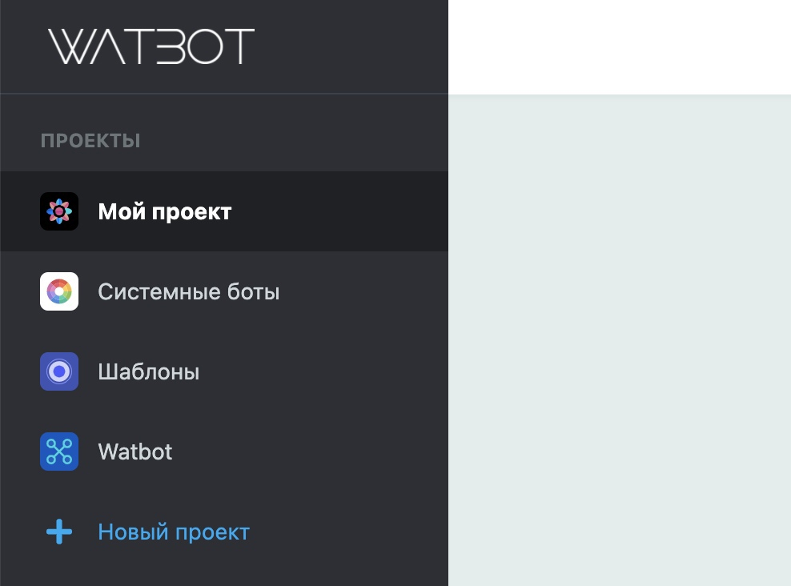

# Группировка ботов и мини-лендингов по проектам

Переработали боковое меню, добавили возможность объединять ваши боты в группы — проекты.&#x20;

* Все проекты отображаются в боковом меню.
* Можно создать до 300 проектов на один аккаунт.
* Для каждого проекта можно выбрать аватарку, изменить имя или назначить по умолчанию.
* Проект по умолчанию отображается всегда наверху и открывается при входе в личный кабинет.

