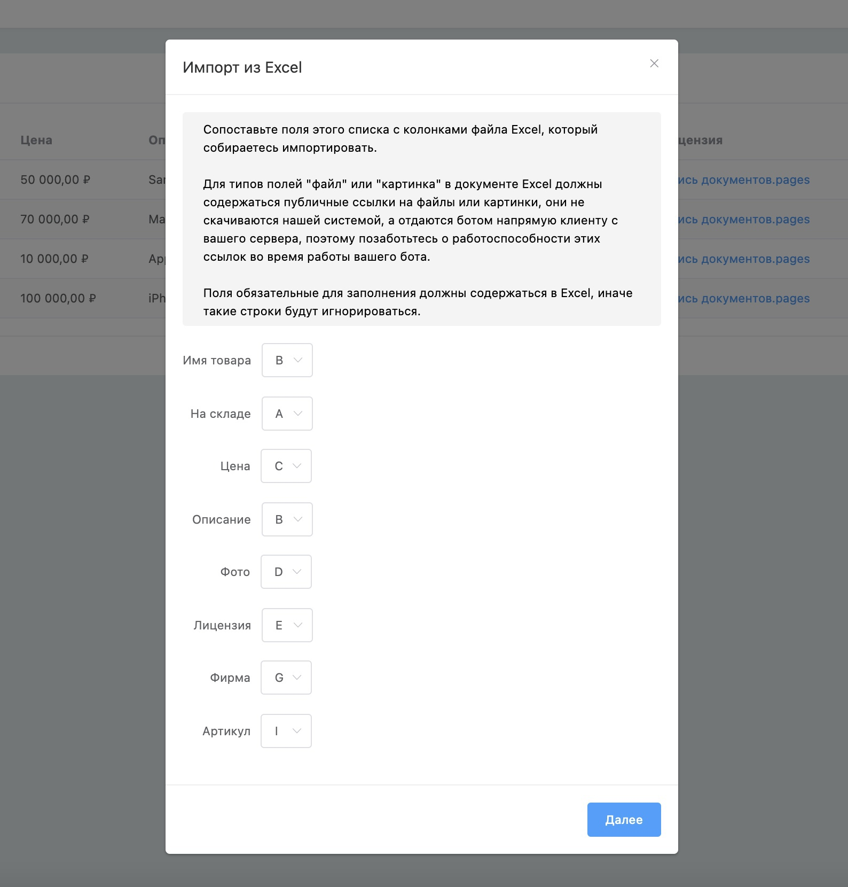
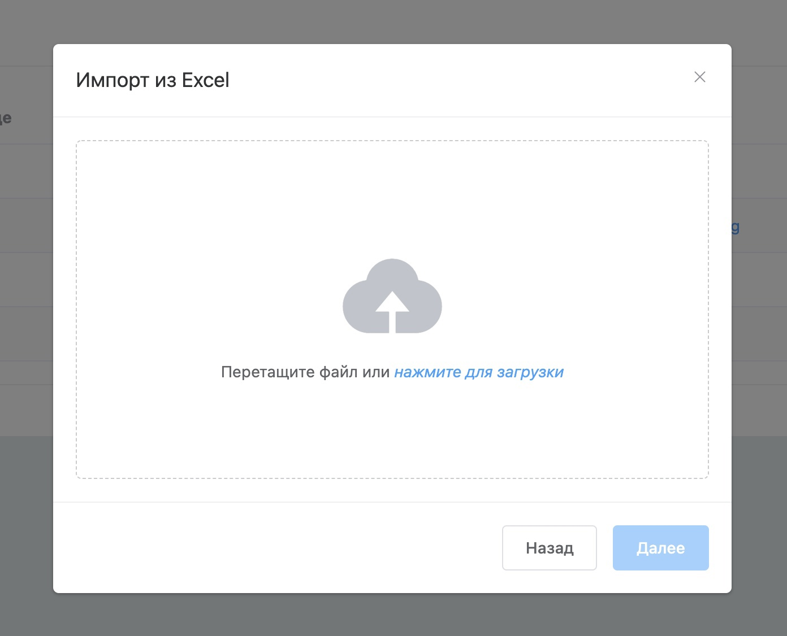

# Импорт из Excel в списки

Разработали возможность импортировать таблицу Microsoft Excel в списки. Например, если вы храните товары в файле Excel или имеете возможность выгрузить их из вашей базы данных, Google Таблиц или CRM в файл Excel, то вы легко сможете загрузить их в вашего бота.

**Шаг 1 — Сопоставление полей.**

**Шаг 2 — Уникальное поле.**

**Шаг 3— Загрузка файла.**

**Результат**

