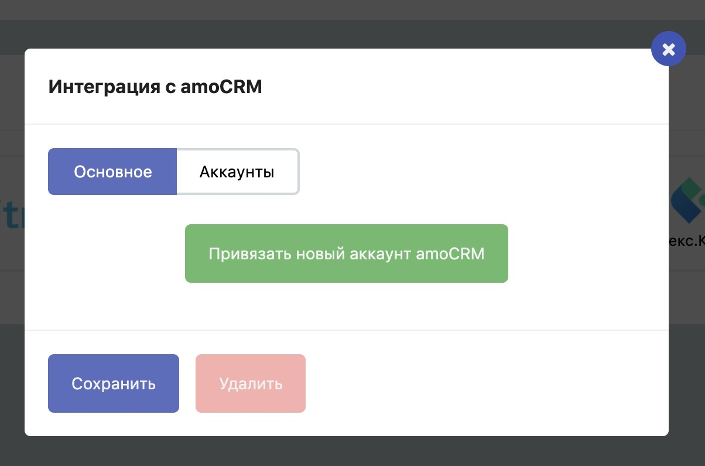
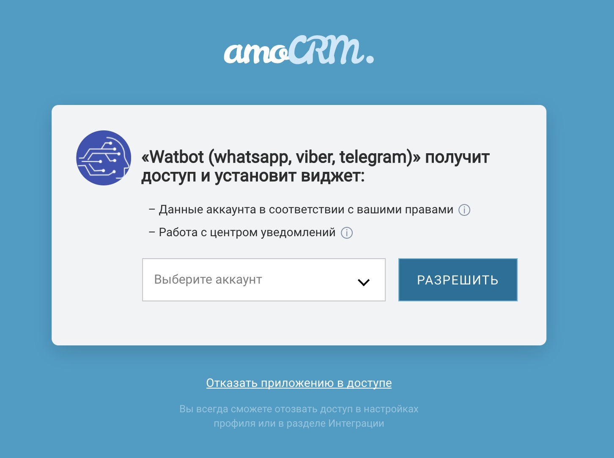

# Интеграция с amoCRM в «один клик»

01.07.2020 amoCRM отказались от устаревшего механизма авторизации интеграций по API-ключам и перешли на новый протокол OAUTH 2.0.

#### Что это значит для пользователей?

Теперь для интеграции достаточно кликнуть по кнопке «Привязать новый аккаунт amoCRM» и во всплывающем окне разрешить доступ приложению Watbot к вашему аккаунту amoCRM.

#### Что будет со старыми интеграциями?

Старые интеграции продолжат работать до тех пор пока в вашем аккаунте amoCRM не изменится API-ключ. Старый интерфейс Watbot для настройки интеграции будет доступен до тех пор, пока вы не удалите интеграцию самостоятельно.&#x20;

Возможно в будущем мы преобразуем все старые интеграции в новые и старый интерфейс удалим навсегда.

**Рекомендуем всем пользователям платформы удалить старую интеграцию и настроить новую. Это займет несколько минут. Для этого зайдите в личный кабинет → Ваш бот → Настройки → Интеграции.**
