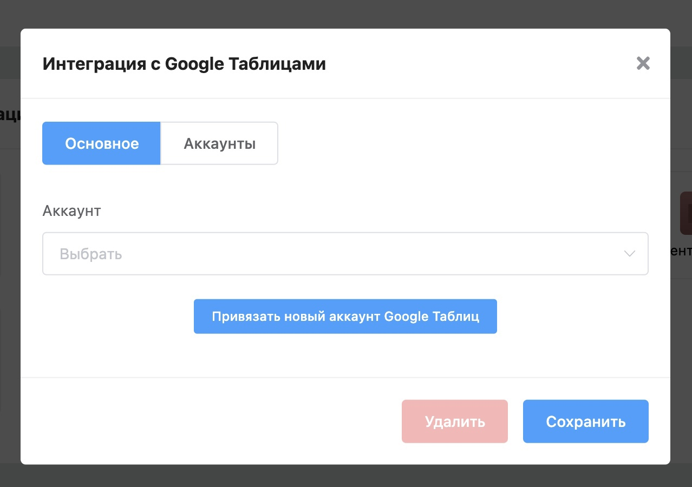
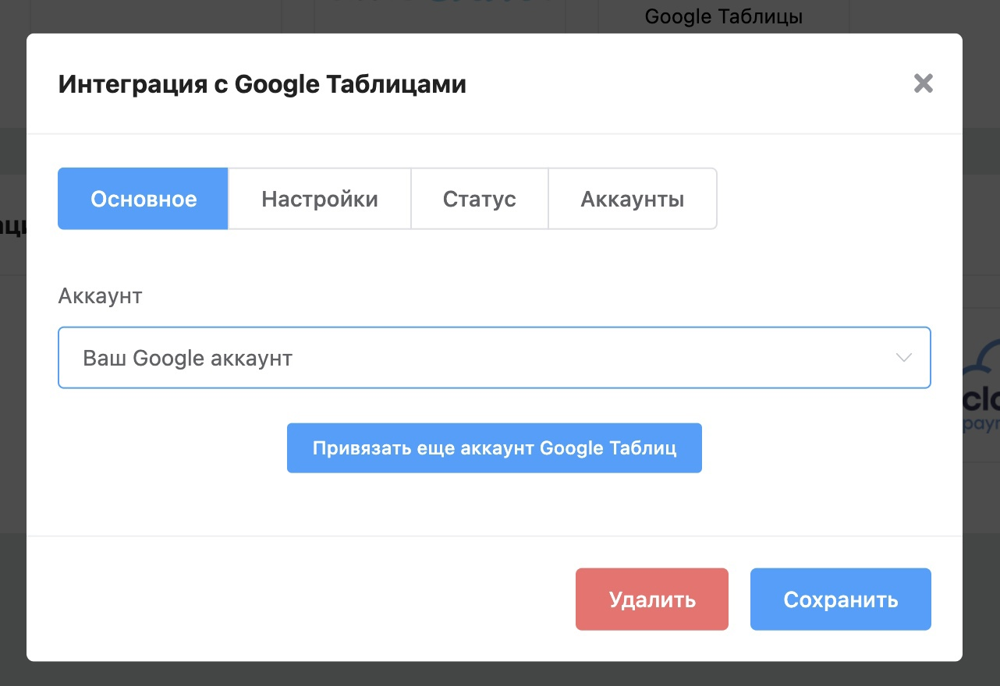

# Интеграция с Google Таблицами

Теперь пользователи бота и их сделки могут отправляться в Google Таблицы. Для этого перейдите в **Вашего бота** → **Настройки** → **Интеграции** → **Google Таблицы** и настройте интеграцию.

1. Нажмите на кнопку **«Привязать новый аккаунт Google Таблиц»** и пройдите окно авторизации.

2\. Выберите привязанный аккаунт

3\. Перейдите во вкладку **Настройки** и задайте имена таблицам для контактов и сделок, затем нажмите на кнопку **«Сохранить»**.

4\. Обновите статус во вкладке **Статус** для того чтобы убедиться что интеграция настроена правильно, в этом случае вы увидите надпись: «Авторизован».

В Google Таблицах будут созданы файлы после взаимодействия нового пользователя с ботом. Эти файлы можно перемещать, переименовывать, таблицу можно редактировать, но не добавлять новые столбцы и строки. Каждый раз когда вы задаете новое имя таблице в настройках интеграции, создается новый файл, а старый больше не заполняется, но редактируется для старых контактов.

Один файл может содержать не более 10000 записей. После заполнения файла создается новый.
