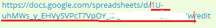

# Таблица Watbot и Google таблица

Когда вы создали таблицу вы можете интегрировать ее с Google Таблицей

Для этого нажмите кнопку Настройки -> Интеграция с Google Таблицей

Выберите аккаут, который вы подключили в боте к Google Таблицам

Далее копируйте ID таблицы из ссылки&#x20;

Пример ссылки на таблицу:&#x20;

<figure><figcaption></figcaption></figure>
