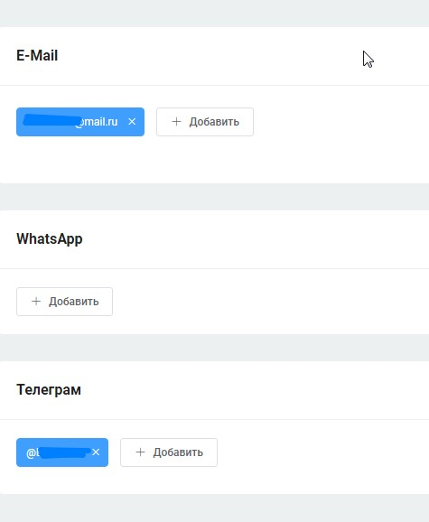
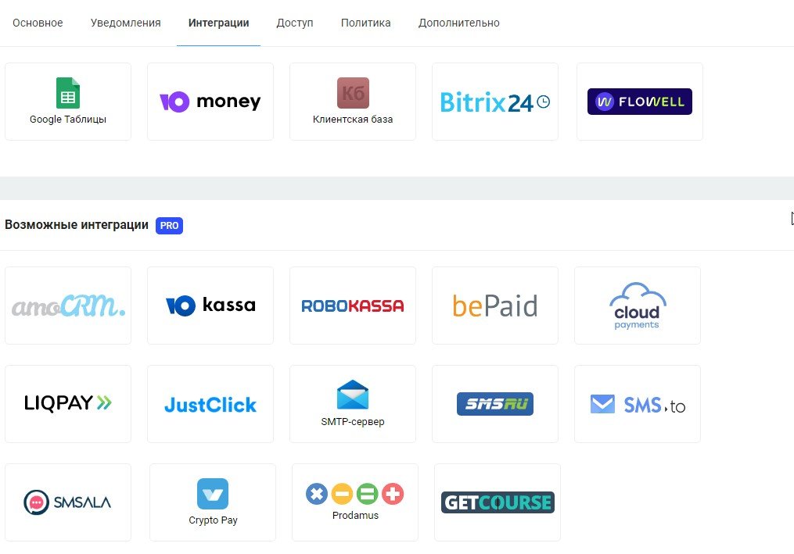
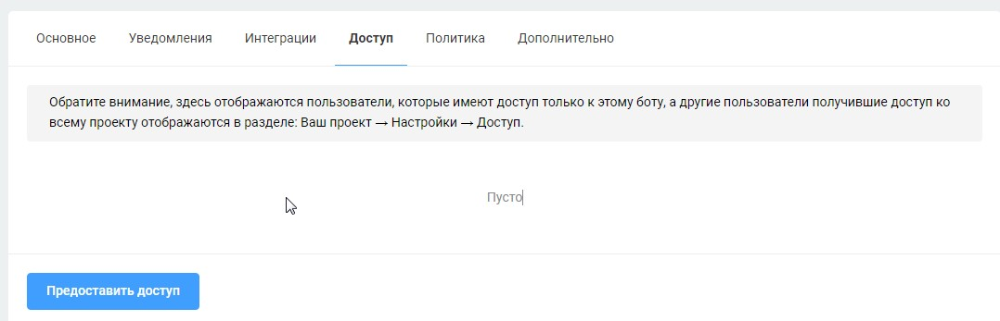
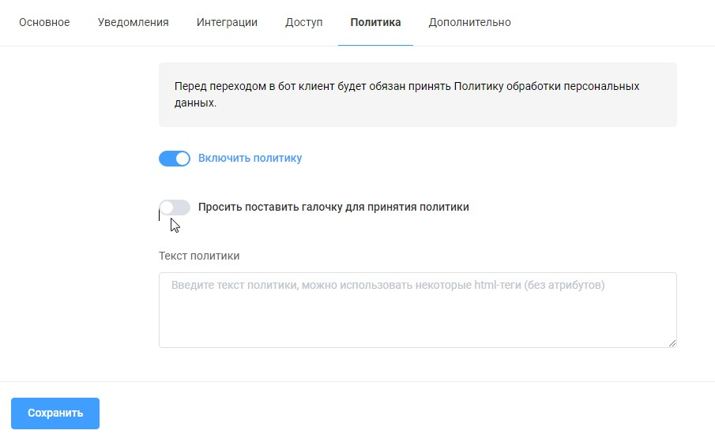
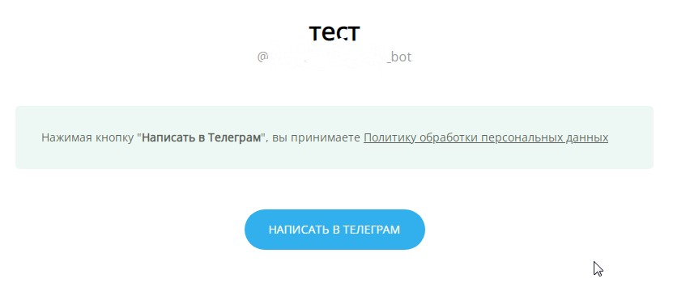
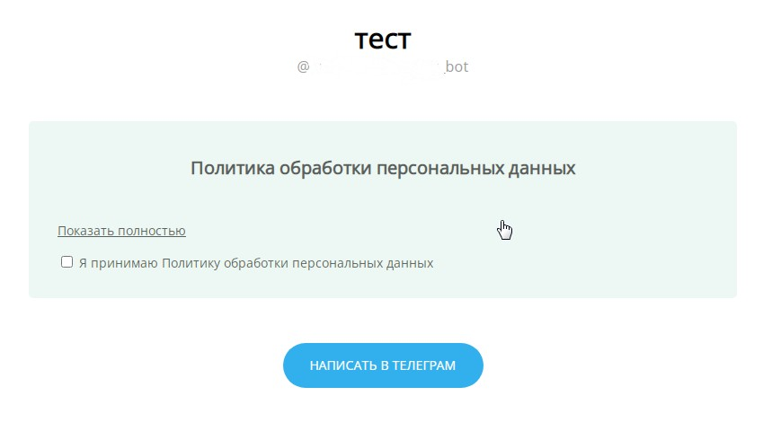
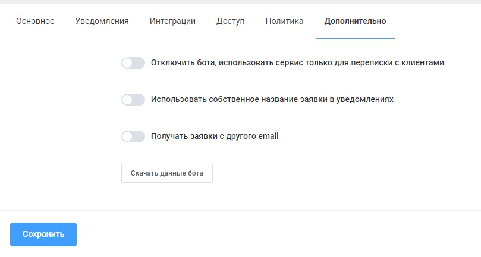

# Настройки бота

Меню настроек находится в левой панели:

<figure><figcaption></figcaption></figure>

В подразделе "основное" вы можете сменить имя бота, которое показывается в проекта аккаунта на платформе, язык меню платформы, тип, нишу, а также отключить бота.

Также в настройках находятся:

* подключение каналов для блока "заявка":

<figure><figcaption></figcaption></figure>

* подключение интеграций:

<figure><figcaption></figcaption></figure>

* &#x20;список пользователей, кому вы можете предоставить заранее созданную роль:

<figure><figcaption></figcaption></figure>

* активация Политики обработки персональных данных:

<figure><figcaption></figcaption></figure>

при активации бегунка "включить политику" будет появляться такое уведомление при переходе в бот по ссылке:

<figure><figcaption></figcaption></figure>

также возможен показ уведомления с боксом для галочки подтверждения при активации одноимённого бегунка:

<figure><figcaption></figcaption></figure>

* дополнительные настройки бота:

<figure><figcaption></figcaption></figure>

При отключении бота будет дезактивирован сценарий, не будут работать кнопки и связи, но мы сможете получать сообщений от пользователей бота и отвечать им через раздел сообщения. Также в данном разделе вы можете изменить названия заявок в уведомлениях и email для заявок.
