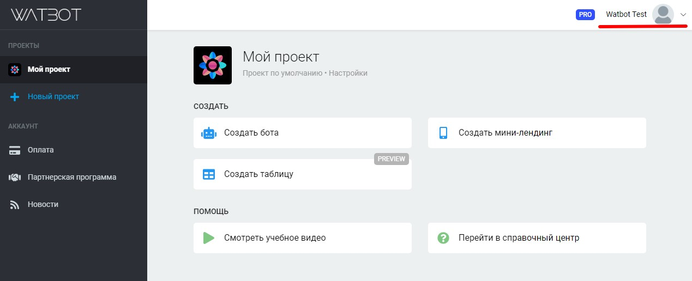
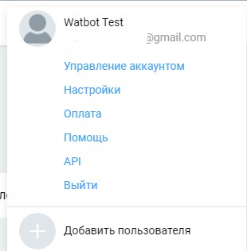
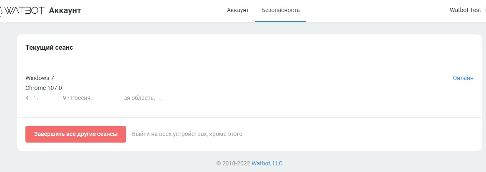

# Настройки аккаунта

Настройки аккаунта можно увидеть в верхнем правом углу, справа от аватарки:

<figure><figcaption></figcaption></figure>

Переходим в управление аккаунтом:

<figure><figcaption></figcaption></figure>

При клике на этот раздел вы перейдёте на страницу настроек. Вы можете сменить имя, почту, пароль, язык, регион, добавить номер телефона, а также удалить ваш аккаунт

<figure><figcaption></figcaption></figure>

Внизу страницы находится кнопки Google и Вконтакте для интеграций с данными сервисами.

<figure><figcaption></figcaption></figure>

Также на этой странице находится раздел "безопасность", где вы можете увидеть все текущие сеансы, а также активные сеансы(включая операционную систему, браузер, адрес апи и гео)

<figure><figcaption></figcaption></figure>
